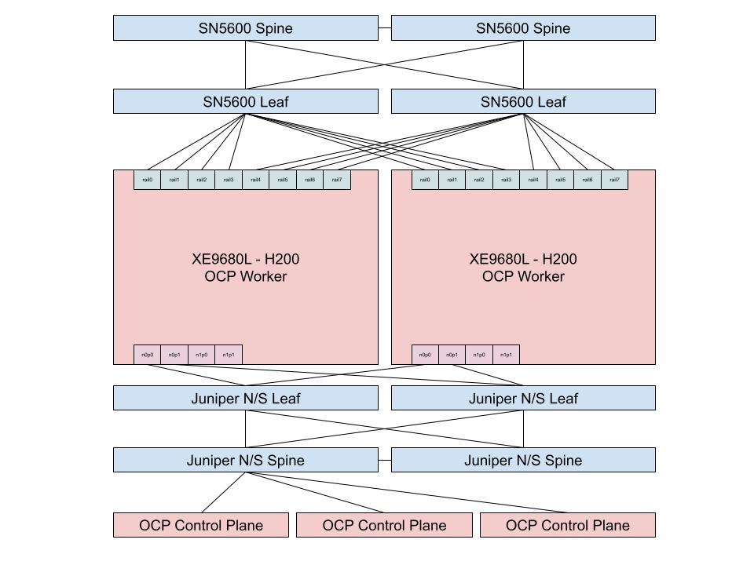

# Spectrum-X Host Configuration on OpenShift

**Goal**: The goal of this document is to document the configuration steps to make OpenShift worker nodes configured for Spectrum-X Single Plane.

## Workflow Sections

- [Environment](#environment)
- [Set Core User Password for Troubleshooting](#set-core-user-password-for-troubleshooting)
- [Set Hugepages and IOMMU off](#set-hugepages-and-iommu-off)
- [Set RDMA Subsystem Namespace Awareness](#set-rdma-subsystem-namespace-awareness)
- [Set UDEV Rules for Rail Device Names](#set-udev-rules-for-rail-device-names)
- [Configuring NFD Operator](#configuring-nfd-operator)
- [Configuring SRIOV Operator](#configuring-sriov-operator)
- [Configuring NMState Operator](#configuring-nmstate-operator)
- [Configuring NVIDIA Network Operator](#configuring-nvidia-network-operator)
- [Configuring NVIDIA Maintenance Operator](#configuring-nvidia-maintenance-operator)
- [Configuring Nic Firmware](#configuring-nic-firmware)
- [Configuring NVIDIA GPU Operator](#configuring-nvidia-gpu-operator)
- [Configuring LLDPD Daemonset](#configuring-lldpd-daemonset)
- [Configuring OVS Offload](#configuring-ovs-offload)
- [Configure Physical Rail Interface Attributes](#configure-physical-rail-interface-attributes)
- [Configure Spectrum-X CNI](#configure-spectrum-x-CNI)
- [FWCTL Kernel Module Required for NIC Configuration Daemon](#fwctl-kernel-module-required-for-nic-configuration-daemon)
- [Validate Spectrum-X Topology](#validate-spectrum-x-topology)
- [Performance Testing and Troubleshooting](#performance-testing-and-troubleshooting)


## Environment

 The host environment for this document was a 5 node cluster where the control plane was virtualized and the two worker nodes were Dell XE9680 H200s running OpenShift 4.20 & 4.21 with Local Volume Storage Operator already configured.  The NFD, SR-IOV, NMState, NVIDIA Network, NVIDIA Maintenance and NVIDIA GPU operators were all installed but need to be configured.

### Issues found in clear OCP 4.22 installation

 On an OpenShift 4.22 cluster with RHCOS 9.8 worker nodes (`5.14.0-687.11.1.el9_8.x86_64` kernel),
the NVIDIA Network Operator MOFED pods were failing to come up with the following chain of errors:

### Stage 1 — Image pull 403 Forbidden
The `ofedDriver` in `NicClusterPolicy` pointed to `nvcr.io/nvstaging/mellanox` (a private staging
registry) but had no `imagePullSecrets` configured. The pods got:
```
Failed to pull image "nvcr.io/nvstaging/mellanox/doca-driver:doca3.4.0-26.04-0.5.3.0-0-rhel9.8-amd64":
received unexpected HTTP status: 403 Forbidden
```

### Stage 2 — Image tag does not exist (`manifest unknown`)
After adding the NGC pull secret, the image pulled but the tag
`doca3.4.0-26.04-0.5.3.0-0-rhel9.8-amd64` **does not exist** in the nvstaging registry.
The registry only publishes up to `rhel9.6` for this DOCA version.

### Stage 3 — OS not supported during driver compilation
After overriding the node NFD label to `VERSION_ID=9.6` so the operator would select the
`rhel9.6` image, the image pulled successfully but the driver compilation failed:
```
Current operation system is not supported!
```
The MLNX_OFED `install.pl` script auto-detects the host OS as `el9_8` and rejects it because
the `rhel9.6` source package does not declare support for `el9_8`.

---

## Root Causes

| # | Root Cause |
|---|---|
| 1 | `ofedDriver.imagePullSecrets` was empty — NGC staging registry requires auth |
| 2 | Image tag `rhel9.8` does not exist in `nvcr.io/nvstaging`; only `rhel9.6` is available for DOCA 3.4.0 |
| 3 | MLNX_OFED `install.pl` rejects the actual node OS (`el9_8`) without a `--distro` override |

---
 


## Create the NGC staging pull secret

The `nvcr.io/nvstaging` registry requires an NGC API key. Create the secret in the operator
namespace before applying the policy:

```bash
oc create secret docker-registry ngc-staging-secret \
  -n nvidia-network-operator \
  --docker-server=nvcr.io \
  --docker-username='$oauthtoken' \
  --docker-password=<YOUR_NGC_API_KEY>
```
> Replace `<YOUR_NGC_API_KEY>` with your NGC personal API key from
> [https://org.ngc.nvidia.com/setup/api-key](https://org.ngc.nvidia.com/setup/api-key).

#### Reference the secret in `ncp-spectrumx.yaml`

Add `imagePullSecrets` to the `ofedDriver` spec:

```yaml
ofedDriver:
  repository: nvcr.io/nvstaging/mellanox
  image: doca-driver
  version: doca3.4.0-26.04-0.5.3.0-0
  imagePullSecrets:
  - ngc-staging-secret
```

## Set Core User Password for Troubleshooting

This section is completely optional but might be useful in the event network connectivity is lost to one of the OpenShift nodes.   Here we will configure a password for the core user so we can login via the console if necessary.  

The first step is to assign a hash password to the core user variable using the `mkpasswd` utlity.  In our example we are passing in `password` as the password.  Choose a password that is appropriate for the organizations password policy. 

~~~bash
$ export COREPASS=`mkpasswd -m SHA-512 password`
~~~

Now we can take the COREPASS variable and use it to construct a MachineConfig that we can apply to our nodes which will set the core user pass to our value.  Note that we are only specifying master node here since we are using single node.

~~~bash
$ cat <<EOF > set-core-user-password-machineconfig.yaml
apiVersion: machineconfiguration.openshift.io/v1
kind: MachineConfig
metadata:
  labels:
    machineconfiguration.openshift.io/role: worker
  name: set-core-user-password
spec:
  config:
    ignition:
      version: 3.2.0
    passwd:
      users:
      - name: core 
        passwordHash: $COREPASS
EOF
~~~

Create the MachineConfig on the cluster.  Note that for this MachineConfig the nodes are not required to reboot.

~~~bash
$ oc create -f set-core-user-password-machineconfig.yaml
machineconfig.machineconfiguration.openshift.io/set-core-user-password created
~~~

We can monitor the progress of setting the core user password MachineConfig using the `oc get mcp` command.

~~~bash
$ oc get mcp
NAME     CONFIG                                             UPDATED   UPDATING   DEGRADED   MACHINECOUNT   READYMACHINECOUNT   UPDATEDMACHINECOUNT   DEGRADEDMACHINECOUNT   AGE
master   rendered-master-fefd989a138b206eab4a9a9362f67a03   False     True       False      1              0                   0                     0                      25h
worker   rendered-worker-d853a15275615906b9d23f4a28e007f4   True      False      False      0              0                   0                     0                      25h
~~~

Before completing this section make sure to test that it is possible to login as the core user on the BMC console as the password that was set.

## Set Hugepages and IOMMU off

Now we need to enable a few kernel arguments which include the blacklisting of irdma, hugepages and enabling iommu.  This can be achieved by generating the following machine configuration.

~~~bash
$ cat <<EOF > 99-machineconfig-kernel-args-hugepages.yaml
apiVersion: machineconfiguration.openshift.io/v1
kind: MachineConfig
metadata:
  labels:
    machineconfiguration.openshift.io/role: worker
  name: 99-kernel-args-hugepages
spec:
  kernelArguments:
    - "module_blacklist=irdma"
    - default_hugepagesz=1G
    - hugepagesz=1G
    - hugepages=16
    - intel_iommu=on
    - iommu=pt
    - pci=realloc=on
EOF
~~~

Using the file we generated above we can create the machine configuration on the cluster.  This will cause nodes to reboot in a rolling fashion and can be monitored with `oc get mcp`.

~~~bash
$ oc create -f 99-machineconfig-kernel-args-hugepages.yaml
machineconfig.machineconfiguration.openshift.io/99-kernel-args-hugepages created
~~~

To validate this has been configured we can use `dmesg` output and `oc describe node` to see iommu and hughpages are set or even better with `cat /proc/cmdline` in each node.

## Set RDMA Subsystem Namespace Awareness

Next we need to enable RDMA device namespace separation, which is essential for proper namespace resource isolation in containerized environments.  First we need to base64 encode the contents of our ib_core.conf file.

~~~bash
$ IB_CORE=$(echo "options ib_core netns_mode=0" | base64 -w 0)
~~~

Once we have the base64 encoding assigned to the variable we can generate the machine configuration yaml that will be used to create the file on the workers in the cluster.

~~~bash
$ cat <<EOF > 99-worker-ib-core-netns.yaml
apiVersion: machineconfiguration.openshift.io/v1
kind: MachineConfig
metadata:
  labels:
    machineconfiguration.openshift.io/role: worker
  name: 99-worker-ib-core-netns
spec:
  config:
    ignition:
      version: 3.2.0
    storage:
      files:
      - contents:
          source: data:text/plain;base64,${IB_CORE}
        mode: 420
        overwrite: true
        path: /etc/modprobe.d/ib_core.conf
EOF
~~~

Now we can create the machine configuration on the cluster.  This will cause nodes to reboot in a rolling fashion and can be monitored with `oc get mcp`.

~~~bash
$ oc create -f 99-worker-ib-core-netns.yaml 
machineconfig.machineconfiguration.openshift.io/99-worker-ib-core-netns created
~~~

Once all the workers have rebooted and the `oc get mcp` no longer indicates it updating we can continue on to the next section.

## Set UDEV Rules for Rail Device Names

We need to use udev rules to normalize the interface names on each node to eth_rail or roce_rail for ethernet and infiniband respectively.   We can do this by creating a persistent udev rules file indicating the devices which should be the same across all worker nodes in a homogenous cluster.   Below is an example of what that file might look like.  On the GH200 node we only have two interfaces to work with but it gives you an idea.

~~~bash
$ cat <<EOF > 70-persistent-net.rules 
ACTION=="add", KERNELS=="0000:18:00.0", SUBSYSTEM=="net", NAME="eth_rail0"
ACTION=="add", KERNELS=="0000:3a:00.0", SUBSYSTEM=="net", NAME="eth_rail1"
ACTION=="add", KERNELS=="0000:4d:00.0", SUBSYSTEM=="net", NAME="eth_rail2"
ACTION=="add", KERNELS=="0000:5d:00.0", SUBSYSTEM=="net", NAME="eth_rail3"
ACTION=="add", KERNELS=="0000:9b:00.0", SUBSYSTEM=="net", NAME="eth_rail4"
ACTION=="add", KERNELS=="0000:ba:00.0", SUBSYSTEM=="net", NAME="eth_rail5"
ACTION=="add", KERNELS=="0000:ca:00.0", SUBSYSTEM=="net", NAME="eth_rail6"
ACTION=="add", KERNELS=="0000:db:00.0", SUBSYSTEM=="net", NAME="eth_rail7"

ACTION=="add", KERNELS=="0000:18:00.0", SUBSYSTEM=="infiniband", PROGRAM="rdma_rename %k NAME_FIXED roce_rail0"
ACTION=="add", KERNELS=="0000:3a:00.0", SUBSYSTEM=="infiniband", PROGRAM="rdma_rename %k NAME_FIXED roce_rail1"
ACTION=="add", KERNELS=="0000:4d:00.0", SUBSYSTEM=="infiniband", PROGRAM="rdma_rename %k NAME_FIXED roce_rail2"
ACTION=="add", KERNELS=="0000:5d:00.0", SUBSYSTEM=="infiniband", PROGRAM="rdma_rename %k NAME_FIXED roce_rail3"
ACTION=="add", KERNELS=="0000:9b:00.0", SUBSYSTEM=="infiniband", PROGRAM="rdma_rename %k NAME_FIXED roce_rail4"
ACTION=="add", KERNELS=="0000:ba:00.0", SUBSYSTEM=="infiniband", PROGRAM="rdma_rename %k NAME_FIXED roce_rail5"
ACTION=="add", KERNELS=="0000:ca:00.0", SUBSYSTEM=="infiniband", PROGRAM="rdma_rename %k NAME_FIXED roce_rail6"
ACTION=="add", KERNELS=="0000:db:00.0", SUBSYSTEM=="infiniband", PROGRAM="rdma_rename %k NAME_FIXED roce_rail7"

EOF
~~~

Once we have the udev file created we need to base64 encoded it to prepare it for a machine configuration.  Below will base64 encoded it and then assign it to the variable UDV_RULES.

~~~bash
$ UDEV_RULES=`cat 70-persistent-net.rules|base64 -w 0`
~~~

Next we can cat out the machine configuration file below and it will use the UDEV_RULES variable we set above to enbedded the base64 udev rules.

~~~bash
$ cat <<EOF > 99-machine-config-udev-network.yaml
apiVersion: machineconfiguration.openshift.io/v1
kind: MachineConfig
metadata:
   labels:
     machineconfiguration.openshift.io/role: worker
   name: 99-machine-config-udev-network
spec:
   config:
     ignition:
       version: 3.2.0
     storage:
       files:
       - contents:
           source: data:text/plain;charset=utf-8;base64,${UDEV_RULES}
         filesystem: root
         mode: 420
         path: /etc/udev/rules.d/70-persistent-net.rules
EOF
~~~

Finally we can create the machine configuration on the cluster.  This will cause nodes to reboot in a rolling fashion and can be monitored with `oc get mcp`.
pay attention to the output of `oc get mcp` , sometimes is not working well and the worker node/s remain in degraded  true.

~~~bash
$ oc create -f 99-machine-config-udev-network.yaml
machineconfig.machineconfiguration.openshift.io/99-machine-config-udev-network created
~~~

Once the machine configuration has been successfully applied we can validate that its applied by spot checking nodes in a debug pod to confirm the interface names have been set appropriately.

~~~bash
$ oc debug node/dell-h200-2
Starting pod/dell-h200-2-debug-pq95j ...
To use host binaries, run `chroot /host`. Instead, if you need to access host namespaces, run `nsenter -a -t 1`.
Pod IP: 10.14.202.16
If you don't see a command prompt, try pressing enter.
sh-5.1# chroot /host
sh-5.1# ip link|grep rail
4: eth_rail0: <BROADCAST,MULTICAST,UP,LOWER_UP> mtu 1500 qdisc mq state UP mode DEFAULT group default qlen 1000
6: eth_rail1: <BROADCAST,MULTICAST,UP,LOWER_UP> mtu 1500 qdisc mq state UP mode DEFAULT group default qlen 1000
7: eth_rail2: <BROADCAST,MULTICAST,UP,LOWER_UP> mtu 1500 qdisc mq state UP mode DEFAULT group default qlen 1000
8: eth_rail3: <BROADCAST,MULTICAST,UP,LOWER_UP> mtu 1500 qdisc mq state UP mode DEFAULT group default qlen 1000
11: eth_rail4: <BROADCAST,MULTICAST,UP,LOWER_UP> mtu 1500 qdisc mq state UP mode DEFAULT group default qlen 1000
12: eth_rail5: <BROADCAST,MULTICAST,UP,LOWER_UP> mtu 1500 qdisc mq state UP mode DEFAULT group default qlen 1000
15: eth_rail6: <BROADCAST,MULTICAST,UP,LOWER_UP> mtu 1500 qdisc mq state UP mode DEFAULT group default qlen 1000
17: eth_rail7: <BROADCAST,MULTICAST,UP,LOWER_UP> mtu 1500 qdisc mq state UP mode DEFAULT group default qlen 1000
~~~

## Configuring NFD Operator

The Node Feature Discovery (NFD) operator manages the detection of hardware features and configuration in an OpenShift Container Platform cluster by labeling the nodes with hardware-specific information. NFD labels the host with node-specific attributes, such as PCI cards, kernel, operating system version, and so on.

We need to create the NodeFeatureDiscovery instance custom resource file. Note that we add entries to the default deviceClasseWhiteList field, so that to support more network adapters, such as the NVIDIA BlueField DPUs.

~~~bash
$ cat <<EOF > nfd-instance.yaml 
apiVersion: nfd.openshift.io/v1
kind: NodeFeatureDiscovery
metadata:
  name: nfd-instance
  namespace: openshift-nfd
spec:
  instance: ''
  operand:
    servicePort: 12000
  prunerOnDelete: false
  topologyUpdater: false
  workerConfig:
    configData: |
      core:
        sleepInterval: 60s
      sources:
        pci:
          deviceClassWhitelist:
            - "02"
            - "03"
            - "0200"
            - "0207"
            - "12"
          deviceLabelFields:
            - "vendor"
EOF
~~~

With our instance custom resource file generated we can create it on the cluster.

~~~bash
$ oc create -f nfd-instance.yaml
nodefeaturediscovery.nfd.openshift.io/nfd-instance created
~~~

Finally we can validate our instance is up and running by again looking at the pods under the openshift-nfd namespace.

~~~bash
$ oc get pods -n openshift-nfd
NAME                                      READY   STATUS    RESTARTS   AGE
nfd-controller-manager-6679c598b9-skbsm   1/1     Running   0          46m
nfd-gc-64d68c6fcf-6mgqx                   1/1     Running   0          8m1s
nfd-master-7977c86865-sgtrw               1/1     Running   0          8m1s
nfd-worker-4pf44                          1/1     Running   0          8m1s
nfd-worker-8z4rt                          1/1     Running   0          8m1s
nfd-worker-m7pfc                          1/1     Running   0          8m1s
nfd-worker-r2fhd                          1/1     Running   0          8m1s
nfd-worker-svcg6                          1/1     Running   0          8m1s
~~~

### Step 2 — Permanently override the NFD OS version label via NodeFeatureRule

NNO uses the node label `feature.node.kubernetes.io/system-os_release.VERSION_ID` to decide which
MOFED image variant to deploy. Since `rhel9.8` images do not exist in nvstaging, this label must
permanently read `9.6` on the RHCOS 9.8 worker nodes.

Node Feature Discovery (NFD) re-sets this label to `9.8` every 60 seconds from the actual OS
release information. A `NodeFeatureRule` is used to permanently override it — NFD rule labels
take precedence over raw worker-detected feature labels.

#### Create the NodeFeatureRule

```bash
oc apply -f - <<'EOF'
apiVersion: nfd.openshift.io/v1alpha1
kind: NodeFeatureRule
metadata:
  name: override-os-version-id-for-mofed
  namespace: openshift-nfd
spec:
  rules:
  - name: "pin-rhcos-9.8-nodes-to-rhel9.6-mofed"
    labels:
      "feature.node.kubernetes.io/system-os_release.VERSION_ID": "9.6"
    matchFeatures:
    - feature: system.osrelease
      matchExpressions:
        ID:
          op: In
          value:
          - "rhel"
        OSTREE_VERSION:
          op: Exists
EOF
```

This rule matches any node where `ID=rhel` **and** `OSTREE_VERSION` exists (exclusive to RHCOS
nodes) and forces `VERSION_ID=9.6`. It survives node reboots, NFD restarts, and cluster upgrades.

After one NFD cycle (~60 seconds), both nodes will show `VERSION_ID=9.6` and NNO will reconcile
to deploy the `mofed-rhel9.6` DaemonSet automatically.

> **To revert** when proper `rhel9.8` images are published to nvstaging:
> ```bash
> oc delete nodefeaturerule override-os-version-id-for-mofed -n openshift-nfd
> ```

If everything looks good we can continue onto the next section of the document.

## Configuring SRIOV Operator

Now we need to generate the default SriovOperatorConfig custom resource file.  The below example in used ensuring we have enabled the manageSoftwareBridges and also disabled the need to wait for the DOCA Mofed containers.

~~~bash
$ cat <<EOF > sriov-operator-config.yaml 
apiVersion: sriovnetwork.openshift.io/v1
kind: SriovOperatorConfig
metadata:
  name: default
  namespace: openshift-sriov-network-operator
spec:
  configDaemonNodeSelector:
    feature.node.kubernetes.io/pci-15b3.sriov.capable: 'true'
    network.nvidia.com/operator.mofed.wait: 'false'
    node-role.kubernetes.io/worker: '' 
  enableInjector: true
  enableOperatorWebhook: true
  featureGates:
    manageSoftwareBridges: true
  logLevel: 2
EOF
~~~

With the file generated we need to create it on our cluster.

~~~bash
$ oc create -f sriov-operator-config.yaml
sriovoperatorconfig.sriovnetwork.openshift.io/default created
~~~

Validate that the pods are running.

~~~bash
$ oc get pods -n openshift-sriov-network-operator
NAME                                      READY   STATUS    RESTARTS   AGE
network-resources-injector-2b54p          1/1     Running   0          14s
network-resources-injector-549w4          1/1     Running   0          14s
network-resources-injector-s88cn          1/1     Running   0          14s
operator-webhook-gkmmk                    1/1     Running   0          14s
operator-webhook-lgrqt                    1/1     Running   0          14s
operator-webhook-wd2rt                    1/1     Running   0          14s
sriov-network-operator-6f7db94664-wn4f7   1/1     Running   0          69m
~~~

If everything looks good we can move onto the next section of the document.

## Configuring NMState Operator

There will be a need to configure network interfaces on the nodes that were not configured at initial cluster creation time and the NMState operator is designed for those use cases. The first step is to create a custom resource file that contains the namespace, operator group and subscription.

A nmstate instance is required so we will create a custom resource file for that.

~~~bash
$ cat <<EOF > nmstate-instance.yaml 
apiVersion: nmstate.io/v1
kind: NMState
metadata:
  name: nmstate
EOF
~~~

Then we will create the instance on the cluster.

~~~bash
$ oc create -f nmstate-instance.yaml
nmstate.nmstate.io/nmstate created
~~~

Finally we will validate the instance is running.

~~~bash
$ oc get pods -n openshift-nmstate
NAME                                      READY   STATUS    RESTARTS   AGE
nmstate-console-plugin-856fbff988-f8bpb   0/1     Running   0          10s
nmstate-handler-2vw4j                     0/1     Running   0          11s
nmstate-handler-5rr4b                     1/1     Running   0          11s
nmstate-handler-5xtbx                     1/1     Running   0          11s
nmstate-handler-8wnx9                     1/1     Running   0          11s
nmstate-handler-fb9hz                     1/1     Running   0          11s
nmstate-metrics-6d46df498c-mnr5t          1/2     Running   0          11s
nmstate-operator-d7769b64b-s8sg6          1/1     Running   0          73m
nmstate-webhook-684cbf4bc8-dkmk6          0/1     Running   0          11s
~~~

We will configure NNCP policies at a later point in this document.

## Configuring NVIDIA Network Operator

With the NVIDIA Network operator up we need to create the NicClusterPolicy custom resource file. The NicClusterPolicy contains all the sub-components that NVIDA Network Operator can deploy.  It is used to deploy DOCA MOFED, Spectrum-X Operator and Nic Configuration Operator.  

However before we can setup our NicClusterPolicy we need to create a persistent volume claim for the Nic firmware to reside which will be referenced in our NicClusterPolicy.   The example below for `nic-fw-storage-pvc` is a persistent volume claim using an existing NFS server. The NFS server could be a share from any NFS location just adjust to fit the environment where this is being deployed.

~~~bash
$ cat <<EOF > nfs-pv.yaml
apiVersion: v1
kind: PersistentVolume
metadata:
  name: nfs-nic-fw-storage
spec:
  capacity:
    storage: 10Gi
  accessModes:
    - ReadWriteMany
  persistentVolumeReclaimPolicy: Retain
  nfs:
    server: nvd-srv-39.nvidia.eng.rdu2.dc.redhat.com
    path: /home/nfs-share/nic-fw-storage
EOF
~~~

With the persistent volume file generated we can now create it on the cluster.

~~~bash
$ oc create -f nfs-pv.yaml
persistentvolume/nfs-nic-fw-storage created
~~~

We can validate the persistent volume is in place by the following.

~~~bash
$ oc get pv
NAME                 CAPACITY   ACCESS MODES   RECLAIM POLICY   STATUS      CLAIM   STORAGECLASS   VOLUMEATTRIBUTESCLASS   REASON   AGE
nfs-nic-fw-storage   10Gi       RWX            Retain           Available                          <unset>                          3s
~~~

We need to create the `nvidia-network-operator` name space before creating the PVC

~~~bash
$ oc create ns nvidia-network-operator
~~~

Next we will need to create a persistent volume claim to bind to the peristent volume we created above.   The file will look similar to the one below.

~~~bash
$ cat <<EOF > nfs-pvc.yaml
apiVersion: v1
kind: PersistentVolumeClaim
metadata:
  name: nic-fw-storage-pvc
  namespace: nvidia-network-operator
spec:
  accessModes:
    - ReadWriteMany
  resources:
    requests:
      storage: 10Gi
  volumeName: nfs-nic-fw-storage
EOF
~~~

Now we can create the persistent volume claim.

~~~bash
$ oc create -f nfs-pvc.yaml
persistentvolumeclaim/nic-fw-storage-pvc created
~~~

We can validate the volume is bound by the following.

~~~bash
$ oc get pvc -n nvidia-network-operator
NAME                 STATUS   VOLUME               CAPACITY   ACCESS MODES   STORAGECLASS   VOLUMEATTRIBUTESCLASS   AGE
nic-fw-storage-pvc   Bound    nfs-nic-fw-storage   10Gi       RWX                           <unset>                 13s
~~~

Now we can generate the NicClusterPolicy for our cluster.

~~~bash
$ cat <<EOF > ncp-spectrumx.yaml
apiVersion: mellanox.com/v1alpha1
kind: NicClusterPolicy
metadata:
  name: nic-cluster-policy
spec:
  nicConfigurationOperator:
    configurationDaemon:
      containerResources:
      - limits:
          cpu: 1000m
          memory: 10000Mi
        name: nic-configuration-daemon
        requests:
          cpu: 1000m
          memory: 10000Mi
      image: nic-configuration-operator-daemon
      repository: nvcr.io/nvidia/mellanox
      version: network-operator-v26.4.0
    logLevel: debug
    nicFirmwareStorage:
      availableStorageSize: 1Gi
      create: false
      pvcName: nic-fw-storage-pvc
    operator:
      containerResources:
      - limits:
          cpu: 1000m
          memory: 10000Mi
        name: nic-configuration-operator
        requests:
          cpu: 1000m
          memory: 10000Mi
      image: nic-configuration-operator
      repository: nvcr.io/nvidia/mellanox
      version: network-operator-v26.4.0
  nvIpam:
    enableWebhook: false
    image: nvidia-k8s-ipam
    repository: nvcr.io/nvidia/mellanox
    version: network-operator-v26.4.0
  ofedDriver:
    env:
    - name: UNLOAD_STORAGE_MODULES
      value: "true"
    forcePrecompiled: false
    image: doca-driver
    imagePullSecrets: []
    livenessProbe:
      initialDelaySeconds: 30
      periodSeconds: 30
    readinessProbe:
      initialDelaySeconds: 10
      periodSeconds: 30
    repository: quay.io/sdambo
    startupProbe:
      initialDelaySeconds: 10
      periodSeconds: 20
    terminationGracePeriodSeconds: 300
    upgradePolicy:
      autoUpgrade: true
      drain:
        deleteEmptyDir: true
        enable: true
        force: true
        timeoutSeconds: 300
      maxParallelUpgrades: 1
      safeLoad: false
    version: doca3.4.0-26.04-0.5.3.0-1
  spectrumXOperator:
    image: spectrum-x-operator
    repository: nvcr.io/nvidia/mellanox
    version: network-operator-v26.4.0
EOF
~~~

Next we can create the NicClusterPolicy custom resource on the cluster.

~~~bash
$ oc create -f ncp-spectrumx.yaml 
nicclusterpolicy.mellanox.com/nic-cluster-policy created
~~~

We can validate the NicClusterPolicy by looking at the running pods.

~~~bash
$ oc get pods -n nvidia-network-operator
NAME                                                          READY   STATUS    RESTARTS   AGE
mofed-rhel9.6-bf9699c58-ds-5wbpr                              2/2     Running   0          5m3s
mofed-rhel9.6-bf9699c58-ds-79qkd                              2/2     Running   0          5m3s
nic-configuration-daemon-25pbl                                1/1     Running   0          59s
nic-configuration-daemon-fxs7b                                1/1     Running   0          62s
nic-configuration-operator-687fc9cc6-cwb77                    1/1     Running   0          5m1s
nv-ipam-controller-6649d985b5-6499q                           1/1     Running   0          5m2s
nv-ipam-controller-6649d985b5-dtvrp                           1/1     Running   0          5m2s
nv-ipam-node-5zhm6                                            1/1     Running   0          5m2s
nv-ipam-node-6llj7                                            1/1     Running   0          5m2s
nv-ipam-node-d6mxg                                            1/1     Running   0          5m2s
nv-ipam-node-nb745                                            1/1     Running   0          5m2s
nv-ipam-node-p9lvd                                            1/1     Running   0          5m2s
nvidia-network-operator-controller-manager-5b9f9dd668-n7262   1/1     Running   0          6m35s
spectrum-x-flowcontroller-448jw                               1/1     Running   0          5m
spectrum-x-flowcontroller-8fvts                               1/1     Running   0          5m
~~~

If everything looks good we can move onto the next section of the documentation.

## Configuring NVIDIA Maintenance Operator

NVIDIA Maintenance Operator provides Kubernetes API(Custom Resource Definition) to allow node maintenance operators in K8s cluster in a coordinated manner. It performs some common operations to prepare a node for maintenance such as cordoning the node as well as draining it.  Users/Consumers can request to perform maintenance on a node by creating NodeMaintenance custom resource. The operator will then reconcile NodeMaintenance custom resources with the following flow:

* Scheduling of NodeMaintenance to be processed by the operator, taking into account constraints such as the maximal allowed parallel operations.
* Node preparation for maintenance such as cordon and draining of the node
* Mark NodeMaintenance as Ready (via condition)
* Cleanup on deletion of NodeMaintenance such as node uncordon

To start the installation we need to generate the following namespace, operatorgroup and subscription file.

~~~bash
$ cat <<EOF > node-maintenance-operator.yaml
apiVersion: v1
kind: Namespace
metadata:
  name: nvidia-maintenance-operator
---
apiVersion: operators.coreos.com/v1
kind: OperatorGroup
metadata:
  name: nvidia-maintenance-operator
  namespace: nvidia-maintenance-operator
spec:
  targetNamespaces:
  - nvidia-maintenance-operator
---
apiVersion: operators.coreos.com/v1alpha1
kind: Subscription
metadata:
  name: nvidia-maintenance-operator
  namespace: nvidia-maintenance-operator
spec:
  channel: v0.2
  installPlanApproval: Automatic
  name: nvidia-maintenance-operator
  source: certified-operators
  sourceNamespace: openshift-marketplace
  startingCSV: nvidia-maintenance-operator.v0.2.3
EOF
~~~

We can then create this on the cluster to start the operator.

Now we need to configure the `MaintenanceOperatorConfig` custom resource file.  In this file we can specify the log level, the number of parallel operations (ie how many nodes to take offline at once) and the time the node is kept in maintenance (a number in seconds that provides enough time for the maintenance work to happen before the operator will remove the node maintenance policy).  In our example we are just going to allow one maintenance operation at a time and that operation has 300 seconds to finish before the node is returned to schedulable.

~~~bash
$ cat <<EOF > maintenance-operator-config.yaml
apiVersion: maintenance.nvidia.com/v1alpha1
kind: MaintenanceOperatorConfig
metadata:
  name: default
  namespace: nvidia-maintenance-operator
spec:
  logLevel: info
  maxParallelOperations: 1
  maxNodeMaintenanceTimeSeconds: 300
EOF
~~~

Now let's create the `MaintenanceOperatorConfig` on the cluster.

~~~bash
$ oc create -f maintenance-operator-config.yaml
maintenanceoperatorconfig.maintenance.nvidia.com/default created
~~~

The `MaintenanceOperatorConfig` does not spin up any additional pods but we can check that it is there by running the following command.

~~~bash
$ oc get MaintenanceOperatorConfig -n nvidia-maintenance-operator -o yaml
apiVersion: v1
items:
- apiVersion: maintenance.nvidia.com/v1alpha1
  kind: MaintenanceOperatorConfig
  metadata:
    creationTimestamp: "2025-10-30T15:41:01Z"
    generation: 1
    name: default
    namespace: nvidia-maintenance-operator
    resourceVersion: "2664798"
    uid: 51d80b8b-eda3-4665-be1b-81f6fca9a64d
  spec:
    logLevel: info
    maxNodeMaintenanceTimeSeconds: 300
    maxParallelOperations: 1
kind: List
metadata:
  resourceVersion: ""

$ oc get pods -n nvidia-maintenance-operator
NAME                                                      READY   STATUS    RESTARTS   AGE
maintenance-operator-controller-manager-995859f88-vq262   1/1     Running   0          18h
~~~

If everything looks good we can move onto the next section.

## Configuring Nic Firmware

NVIDIA NIC Configuration Operator provides Kubernetes API(Custom Resource Definition) to allow FW configuration on Nvidia NICs in a coordinated manner. It deploys, based on settings in the NicClusterPolicy, a configuration daemon on each of the desired nodes to configure Nvidia NICs there. NVIDIA NIC Configuration Operator uses the Maintenance Operator to prepare a node for maintenance before the actual configuration.

We need to define the following NicFirmwareSource file.  This tells the operator where to get the firmware. for RA2.1 you don't need to specify the doca spcx CC. It's built into the nic daemon image

~~~bash
$ cat <<EOF > fwsource.yaml
apiVersion: configuration.net.nvidia.com/v1alpha1
kind: NicFirmwareSource
metadata:
  name: spc-x-doca-pcc
  namespace: nvidia-network-operator
spec:
  bfbUrlSource: https://content.mellanox.com/BlueField/FW-Bundle/bf-fwbundle-3.3.0-202_26.01-prod.bfb 
EOF
~~~

We can then create the resource on the cluster.

~~~bash
$ oc create -f fwsource.yaml 
nicfirmwaresource.configuration.net.nvidia.com/spc-x-doca-pcc created
~~~

In the logs of the Nic Configuration Operator pod we can confirm the download is working by seeing the following.

~~~bash
$ oc logs -f -n nvidia-network-operator nic-configuration-operator-687fc9cc6-cwb77
2026-05-21T23:09:03.518133057Z	LEVEL(-2)	controller/nicfirmwaresource_controller.go:51	reconciling NicFirmwareSource object	{"name": "spc-x-doca-pcc"}
2026-05-21T23:09:03.518184621Z	LEVEL(-2)	firmware/provisioning.go:86	FirmwareProvisioner.IsFWStorageAvailable()
2026-05-21T23:09:03.52714696Z	INFO	firmware/provisioning.go:538	File already present, skipping download	{"cacheDir": "/nic-firmware/spc-x-doca-pcc/bfb", "url": "https://content.mellanox.com/BlueField/FW-Bundle/bf-fwbundle-3.3.0-202_26.01-prod.bfb", "file": "bf-fwbundle-3.3.0-202_26.01-prod.bfb"}
2026-05-21T23:09:03.527579916Z	LEVEL(-2)	firmware/utils.go:265	FirmwareUtils.GetFWVersionsFromBFB()	{"bfbPath": "/nic-firmware/spc-x-doca-pcc/bfb/bf-fwbundle-3.3.0-202_26.01-prod.bfb"}
2026-05-21T23:09:03.527603393Z	LEVEL(-2)	firmware/utils.go:269	Extracting info-v0 file from BFB	{"bfbPath": "/nic-firmware/spc-x-doca-pcc/bfb/bf-fwbundle-3.3.0-202_26.01-prod.bfb"}
2026-05-21T23:09:03.628919936Z	LEVEL(-2)	firmware/utils.go:294	Extracting versions from info-v0 file	{"bfbPath": "/nic-firmware/spc-x-doca-pcc/bfb/bf-fwbundle-3.3.0-202_26.01-prod.bfb"}
2026-05-21T23:09:03.636804715Z	LEVEL(-2)	firmware/utils.go:305	GetFWVersionsFromBFB(): Version is empty or not found, skipping	{"name": "BF4_NIC_FW"}
2026-05-21T23:09:03.636856373Z	INFO	controller/nicfirmwaresource_controller.go:229	BFB file successfully processed	{"cacheName": "spc-x-doca-pcc", "filename": ""}
~~~

The NicFirmwareTemplate file will instruct the Nic Configuration Operator on what network cards it should update and with what firmware source defined.

~~~bash
$ cat <<EOF > fwtemplate.yaml 
apiVersion: configuration.net.nvidia.com/v1alpha1
kind: NicFirmwareTemplate
metadata:
  name: spectrum-x-configuration
  namespace: nvidia-network-operator
spec:
  nodeSelector:
    node-role.kubernetes.io/worker: ""
  nicSelector:
    nicType: "a2dc" # BlueField-3 SuperNIC Type
    pciAddresses:
    - "0000:18:00.0" 
    - "0000:1a:00.0" 
    - "0000:3a:00.0" 
    - "0000:4d:00.0" 
    - "0000:5d:00.0" 
    - "0000:9b:00.0"
    - "0000:ba:00.0"
    - "0000:ca:00.0"
    - "0000:cc:00.0"
    - "0000:db:00.0"
  template:
    nicFirmwareSourceRef: spc-x-doca-pcc
    updatePolicy: Update
EOF
~~~

We can then create the resource on the cluster.

~~~bash
$ oc create -f fwtemplate.yaml
nicfirmwaretemplate.configuration.net.nvidia.com/spectrum-x-configuration created
~~~

Let's tail the logs again of the `nic-configuration-operator` pod again.

~~~bash
$ oc logs -f -n nvidia-network-operator nic-configuration-operator-687fc9cc6-cwb77
2026-01-07T07:57:45.554318301Z	LEVEL(-2)	controller/nicfirmwaretemplate_controller.go:61	Listed templates	{"templates": [{"kind":"NicFirmwareTemplate","apiVersion":"configuration.net.nvidia.com/v1alpha1","metadata":{"name":"spectrum-x-configuration","namespace":"nvidia-network-operator","uid":"92c6f791-4551-4b99-92ef-1a8d70d6b245","resourceVersion":"72316629","generation":1,"creationTimestamp":"2025-12-31T10:07:08Z","labels":{"machineconfiguration.openshift.io/role":"worker"},"managedFields":[{"manager":"kubectl-create","operation":"Update","apiVersion":"configuration.net.nvidia.com/v1alpha1","time":"2025-12-31T10:07:08Z","fieldsType":"FieldsV1","fieldsV1":{"f:metadata":{"f:labels":{".":{},"f:machineconfiguration.openshift.io/role":{}}},"f:spec":{".":{},"f:nicSelector":{".":{},"f:nicType":{},"f:pciAddresses":{}},"f:nodeSelector":{},"f:template":{".":{},"f:nicFirmwareSourceRef":{},"f:updatePolicy":{}}}}},{"manager":"manager","operation":"Update","apiVersion":"configuration.net.nvidia.com/v1alpha1","time":"2025-12-31T10:07:09Z","fieldsType":"FieldsV1","fieldsV1":{"f:status":{".":{},"f:nicDevices":{}}},"subresource":"status"}]},"spec":{"nicSelector":{"nicType":"a2dc","pciAddresses":["0000:18:00.0","0000:1a:00.0","0000:3a:00.0","0000:4d:00.0","0000:5d:00.0","0000:9b:00.0","0000:ba:00.0","0000:ca:00.0","0000:cc:00.0","0000:db:00.0"]},"template":{"nicFirmwareSourceRef":"spc-x-doca-pcc","updatePolicy":"Update"}},"status":{"nicDevices":["dell-h200-3-a2dc-vn0kk4nrfcbnv48b63k3","dell-h200-3-a2dc-vn0kk4nrfcbnv48b63fv","dell-h200-3-a2dc-vn0kk4nrfcbnv48b63bk","dell-h200-3-a2dc-vn0kk4nrfcbnv48u600r","dell-h200-2-a2dc-vn0kk4nrfcbnv48b63ch","dell-h200-2-a2dc-vn0kk4nrfcbnv48b63fz","dell-h200-3-a2dc-vn0kk4nrfcbnv48b63ek","dell-h200-2-a2dc-vn0kk4nrfcbnv495604l","dell-h200-2-a2dc-vn0kk4nrfcbnv495600m","dell-h200-2-a2dc-vn0kk4nrfcbnv495603b","dell-h200-2-a2dc-vn0kk4nrfcbnv48b63jr","dell-h200-2-a2dc-vn0kk4nrfcbnv48b63jt","dell-h200-3-a2dc-vn0kk4nrfcbnv48b63jw","dell-h200-3-a2dc-vn0kk4nrfcbnv48b63j5","dell-h200-3-a2dc-vn0kk4nrfcbnv48b63dz","dell-h200-3-a2dc-vn0kk4nrfcbnv48b63ka","dell-h200-3-a2dc-vn0kk4nrfcbnv48b63es","dell-h200-2-a2dc-vn0kk4nrfcbnv495600o","dell-h200-2-a2dc-vn0kk4nrfcbnv48b637k","dell-h200-2-a2dc-vn0kk4nrfcbnv48b63f3"]}}]}
2026-01-07T07:57:45.554427606Z	LEVEL(-2)	controller/template_matcher.go:51	Listed devices	{"count": 24}
2026-01-07T07:57:45.554584216Z	LEVEL(-2)	controller/template_matcher.go:59	Listed nodes	{"count": 5}
2026-01-07T07:57:45.554611976Z	LEVEL(-2)	controller/nicfirmwaretemplate_controller.go:104	Applying template spectrum-x-configuration to device dell-h200-2-a2dc-vn0kk4nrfcbnv495604l
2026-01-07T07:57:45.55462141Z	LEVEL(-2)	controller/nicfirmwaretemplate_controller.go:104	Applying template spectrum-x-configuration to device dell-h200-3-a2dc-vn0kk4nrfcbnv48b63ek
2026-01-07T07:57:45.554629304Z	LEVEL(-2)	controller/nicfirmwaretemplate_controller.go:104	Applying template spectrum-x-configuration to device dell-h200-3-a2dc-vn0kk4nrfcbnv48b63j5
2026-01-07T07:57:45.554635832Z	LEVEL(-2)	controller/nicfirmwaretemplate_controller.go:104	Applying template spectrum-x-configuration to device dell-h200-3-a2dc-vn0kk4nrfcbnv48b63jw
2026-01-07T07:57:45.55464101Z	LEVEL(-2)	controller/nicfirmwaretemplate_controller.go:104	Applying template spectrum-x-configuration to device dell-h200-3-a2dc-vn0kk4nrfcbnv48u600r
2026-01-07T07:57:45.554645877Z	LEVEL(-2)	controller/nicfirmwaretemplate_controller.go:104	Applying template spectrum-x-configuration to device dell-h200-2-a2dc-vn0kk4nrfcbnv48b63ch
2026-01-07T07:57:45.554650203Z	LEVEL(-2)	controller/nicfirmwaretemplate_controller.go:104	Applying template spectrum-x-configuration to device dell-h200-2-a2dc-vn0kk4nrfcbnv48b63fz
~~~

The NicConfigurationTemplate file will instruct the Nic Configuration Operator how to configure the network cards for Spectrum-X.

~~~bash
$ cat <<EOF > configtemplate.yaml 
apiVersion: configuration.net.nvidia.com/v1alpha1
kind: NicConfigurationTemplate
metadata:
  name: spc-x-config
  namespace: nvidia-network-operator
spec:
  nicSelector:
    nicType: a2dc
    pciAddresses:
    - 0000:18:00.0
    - 0000:3a:00.0
    - 0000:4d:00.0
    - 0000:5d:00.0
    - 0000:9b:00.0
    - 0000:ba:00.0
    - 0000:ca:00.0
    - 0000:db:00.0
  nodeSelector:
    node-role.kubernetes.io/worker: ""
  resetToDefault: false
  template:
    linkType: Ethernet
    numVfs: 1
    spectrumXOptimized:
      enabled: true
      overlay: none
      version: RA2.1
EOF
~~~

Now let's create the NicConfigurationTemplate on the cluster.

~~~bash
$ oc create -f nic-config-template.yaml
nicconfigurationtemplate.configuration.net.nvidia.com/spc-x-config created
~~~

Let's tail the logs again of the `nic-configuration-operator` pod again.

~~~bash
$ oc logs -f -n nvidia-network-operator nic-configuration-operator-687fc9cc6-cwb77
2026-05-06T09:23:10.177271187Z	LEVEL(-2)	controller/nicconfigurationtemplate_controller.go:126	Applying template spc-x-config to device dell-h200-3-a2dc-vn0kk4nrfcbnv48b63dz
2026-05-06T09:23:10.177287008Z	LEVEL(-2)	controller/nicconfigurationtemplate_controller.go:126	Applying template spc-x-config to device dell-h200-3-a2dc-vn0kk4nrfcbnv48b63ek
2026-05-06T09:23:10.177293925Z	LEVEL(-2)	controller/nicconfigurationtemplate_controller.go:126	Applying template spc-x-config to device dell-h200-3-a2dc-vn0kk4nrfcbnv48b63fv
2026-05-06T09:23:10.177298917Z	LEVEL(-2)	controller/nicconfigurationtemplate_controller.go:126	Applying template spc-x-config to device dell-h200-3-a2dc-vn0kk4nrfcbnv48u600r
2026-05-06T09:23:10.177305884Z	LEVEL(-2)	controller/nicconfigurationtemplate_controller.go:126	Applying template spc-x-config to device dell-h200-2-a2dc-vn0kk4nrfcbnv48b63fz
2026-05-06T09:23:10.177311179Z	LEVEL(-2)	controller/nicconfigurationtemplate_controller.go:126	Applying template spc-x-config to device dell-h200-2-a2dc-vn0kk4nrfcbnv495600o
2026-05-06T09:23:10.177316032Z	LEVEL(-2)	controller/nicconfigurationtemplate_controller.go:126	Applying template spc-x-config to device dell-h200-3-a2dc-vn0kk4nrfcbnv48b63bk
2026-05-06T09:23:10.177320412Z	LEVEL(-2)	controller/template_matcher.go:86	Device doesn't match any configuration template, resetting the spec	{"device": "dell-h200-3-a2dc-vn0kk4nrfcbnv48b63jw"}
2026-05-06T09:23:10.226463124Z	LEVEL(-2)	controller/nicconfigurationtemplate_controller.go:126	Applying template spc-x-config to device dell-h200-3-a2dc-vn0kk4nrfcbnv48b63ka
2026-05-06T09:23:10.226473054Z	LEVEL(-2)	controller/template_matcher.go:86	Device doesn't match any configuration template, resetting the spec	{"device": "dell-h200-2-a2dc-vn0kk4nrfcbnv48b637k"}
2026-05-06T09:23:10.276467313Z	LEVEL(-2)	controller/nicconfigurationtemplate_controller.go:126	Applying template spc-x-config to device dell-h200-2-a2dc-vn0kk4nrfcbnv48b63ch
2026-05-06T09:23:10.276488071Z	LEVEL(-2)	controller/template_matcher.go:86	Device doesn't match any configuration template, resetting the spec	{"device": "dell-h200-3-a2dc-il0hfwrm7403146a00k8"}
2026-05-06T09:23:10.324975338Z	LEVEL(-2)	controller/nicconfigurationtemplate_controller.go:126	Applying template spc-x-config to device dell-h200-3-a2dc-vn0kk4nrfcbnv48b63es
2026-05-06T09:23:10.324983742Z	LEVEL(-2)	controller/nicconfigurationtemplate_controller.go:126	Applying template spc-x-config to device dell-h200-3-a2dc-vn0kk4nrfcbnv48b63j5
2026-05-06T09:23:10.324989508Z	LEVEL(-2)	controller/template_matcher.go:86	Device doesn't match any configuration template, resetting the spec	{"device": "dell-h200-2-a2dc-il0hfwrm7403146a00mn"}
2026-05-06T09:23:10.376169565Z	LEVEL(-2)	controller/nicconfigurationtemplate_controller.go:126	Applying template spc-x-config to device dell-h200-2-a2dc-vn0kk4nrfcbnv48b63f3
~~~

If everything looks good we can move onto the next section.

## Configuring NVIDIA GPU Operator

The NVIDIA GPU Operator is installed but we need to create a GPU cluster policy custom resource file like the one below.

~~~bash
$ cat <<EOF > gpu-cluster-policy.yaml 
apiVersion: nvidia.com/v1
kind: ClusterPolicy
metadata:
  name: gpu-cluster-policy
spec:
  vgpuDeviceManager:
    config:
      default: default
    enabled: true
  migManager:
    config:
      default: all-disabled
      name: default-mig-parted-config
    enabled: true
  operator:
    defaultRuntime: crio
    initContainer: {}
    runtimeClass: nvidia
    use_ocp_driver_toolkit: true
  dcgm:
    enabled: true
  gfd:
    enabled: true
  dcgmExporter:
    config:
      name: ''
    serviceMonitor:
      enabled: true
    enabled: true
  cdi:
    default: false
    enabled: false
  driver:
    licensingConfig:
      nlsEnabled: true
      configMapName: ''
    kernelModuleType: open
    certConfig:
      name: ''
    kernelModuleConfig:
      name: ''
    upgradePolicy:
      autoUpgrade: true
      drain:
        deleteEmptyDir: false
        enable: false
        force: false
        timeoutSeconds: 300
      maxParallelUpgrades: 1
      maxUnavailable: 25%
      podDeletion:
        deleteEmptyDir: false
        force: false
        timeoutSeconds: 300
      waitForCompletion:
        timeoutSeconds: 0
      kernelModuleType: auto
    repoConfig:
      configMapName: ''
    virtualTopology:
      config: ''
    enabled: true
    useNvidiaDriverCRD: false
  devicePlugin:
    config:
      name: ''
      default: ''
    mps:
      root: /run/nvidia/mps
    enabled: true
  gdrcopy:
    enabled: true
  kataManager:
    config:
      artifactsDir: /opt/nvidia-gpu-operator/artifacts/runtimeclasses
  mig:
    strategy: single
  sandboxDevicePlugin:
    enabled: true
  validator:
    plugin:
      env:
        - name: WITH_WORKLOAD
          value: 'false'
  nodeStatusExporter:
    enabled: true
  daemonsets:
    rollingUpdate:
      maxUnavailable: '1'
    updateStrategy: RollingUpdate
  sandboxWorkloads:
    defaultWorkload: container
    enabled: false
  gds:
    enabled: true
    image: nvidia-fs
    repository: nvcr.io/nvidia/cloud-native
    version: 2.27.3
  vgpuManager:
    enabled: false
  vfioManager:
    enabled: true
  toolkit:
    installDir: /usr/local/nvidia
    enabled: true
EOF
~~~

With the GPU ClusterPolicy custom resource generated, let's create it on the cluster on the cluster.

~~~bash
$ oc create -f gpu-cluster-policy.yaml
clusterpolicy.nvidia.com/gpu-cluster-policy created
~~~

Then let's validate the pods are all running.  

~~~bash
$ oc get pods -n nvidia-gpu-operator
NAME                                           READY   STATUS      RESTARTS      AGE
gpu-feature-discovery-8lp24                    1/1     Running     0             4m14s
gpu-feature-discovery-9schj                    1/1     Running     0             4m44s
gpu-operator-646fb4476b-lkffh                  1/1     Running     0             4h43m
nvidia-container-toolkit-daemonset-766vl       1/1     Running     0             4m44s
nvidia-container-toolkit-daemonset-89mjj       1/1     Running     0             4m14s
nvidia-cuda-validator-6kltl                    0/1     Completed   0             103s
nvidia-cuda-validator-wfxk2                    0/1     Completed   0             69s
nvidia-dcgm-exporter-6h22n                     1/1     Running     2 (74s ago)   4m44s
nvidia-dcgm-exporter-cn2cp                     0/1     Running     2 (39s ago)   4m14s
nvidia-dcgm-t2hc6                              1/1     Running     0             4m14s
nvidia-dcgm-vgvxt                              1/1     Running     0             4m44s
nvidia-device-plugin-daemonset-9l75p           1/1     Running     0             4m14s
nvidia-device-plugin-daemonset-ct7sg           1/1     Running     0             4m44s
nvidia-driver-daemonset-9.6.20260510-0-pg4wj   4/4     Running     0             4m51s
nvidia-driver-daemonset-9.6.20260510-0-xmtk6   4/4     Running     0             4m51s
nvidia-mig-manager-hdbfv                       1/1     Running     0             26s
nvidia-mig-manager-sqqpn                       1/1     Running     0             26s
nvidia-node-status-exporter-cr56n              1/1     Running     0             4m48s
nvidia-node-status-exporter-sk5ww              1/1     Running     0             4m48s
nvidia-operator-validator-98clm                1/1     Running     0             4m14s
nvidia-operator-validator-nsd9d                1/1     Running     0             4m44s
~~~

Validate that `nvidia-smi` reponds and kernel modules are loaded.

~~~bash
$ oc rsh -n nvidia-gpu-operator $(oc -n nvidia-gpu-operator get pod -o name -l app.kubernetes.io/component=nvidia-driver | head -1)
sh-5.1# nvidia-smi
Fri Oct 31 16:04:06 2025       
+-----------------------------------------------------------------------------------------+
| NVIDIA-SMI 580.95.05              Driver Version: 580.95.05      CUDA Version: 13.0     |
+-----------------------------------------+------------------------+----------------------+
| GPU  Name                 Persistence-M | Bus-Id          Disp.A | Volatile Uncorr. ECC |
| Fan  Temp   Perf          Pwr:Usage/Cap |           Memory-Usage | GPU-Util  Compute M. |
|                                         |                        |               MIG M. |
|=========================================+========================+======================|
|   0  NVIDIA GH200 480GB             On  |   00000009:01:00.0 Off |                    0 |
| N/A   24C    P0             85W /  700W |       0MiB /  97871MiB |      0%      Default |
|                                         |                        |             Disabled |
+-----------------------------------------+------------------------+----------------------+

+-----------------------------------------------------------------------------------------+
| Processes:                                                                              |
|  GPU   GI   CI              PID   Type   Process name                        GPU Memory |
|        ID   ID                                                               Usage      |
|=========================================================================================|
|  No running processes found                                                             |
+-----------------------------------------------------------------------------------------+

sh-5.1# lsmod|grep nvidia
nvidia_fs             303104  0
nvidia_modeset       1949696  0
nvidia_uvm           3305472  12
nvidia              14544896  26 nvidia_uvm,nvidia_fs,gdrdrv,nvidia_modeset
video                  69632  1 nvidia_modeset
nvidia_cspmu           40960  0
arm_cspmu_module       32768  1 nvidia_cspmu
drm                   684032  5 drm_kms_helper,ast,drm_shmem_helper,nvidia
~~~

If everything looks good we can move onto the next section.

## Configuring LLDPD Daemonset

In networking infrastructure, LLDP (Link Layer Discovery Protocol) is utilized to automate the discovery and configuration of NVIDIA Spectrum-X fabrics, ensuring optimal performance for large-scale AI and machine learning (ML) workloads

To run our lldpd container daemonset we will need to provide a service account with privilege access similar to what we do with NMState.   The first step is to create a service account we will simply call lldp.  In this example I am creating it under the nvidia-network-operator namespace.  First craft the custom resource file.

~~~bash
$ cat <<EOF > lldp-serviceaccount.yaml
apiVersion: v1
kind: ServiceAccount
metadata:
  name: lldp
  namespace: nvidia-network-operator
EOF
~~~

Then use the custom resource file to create the service account on the cluster.

~~~bash
$ oc create -f lldp-serviceaccount.yaml 
serviceaccount/lldp created
~~~

Once the service account is created we can apply the privileges to it.

~~~bash
$ oc -n nvidia-network-operator adm policy add-scc-to-user privileged -z lldp
clusterrole.rbac.authorization.k8s.io/system:openshift:scc:privileged added: "lldp"
~~~

With our service account created and given the permissision it needs we can now focus on creating our lldpd daemonset.   This daemonset will live in the nvidia-network-operator namespace as well.  Further in this example I am assiging a secondary resource to enable a secondary interface that is connected to the Spectrum-X switch.  That way we can demonsrate the sending and recieving of lldp packets.  Create the below custom resource file and modify as necessary for the environment.

~~~bash
$ cat <<EOF > lldpd-daemonset.yaml 
apiVersion: apps/v1
kind: DaemonSet
metadata:
  name: lldpd-container
  namespace: nvidia-network-operator
  labels:
    app: lldpd
spec:
  selector:
    matchLabels:
      app: lldpd
  template:
    metadata:
      labels:
        app: lldpd
    spec:
      serviceAccountName: lldp
      hostNetwork: true
      containers:
        - name: lldpd-container
          image: quay.io/redhat_emp1/ecosys-nvidia/lldpd:0.0.5
          securityContext:
            privileged: true
EOF
~~~

Once we have created the daemonset custom resource file we can create it on the cluster.

~~~bash
$ oc create -f lldpd-daemonset.yaml 
daemonset.apps/lldpd-container created
~~~

We can validate it is running by looking at the pods in the nvidia-network-operator namespace.

~~~bash
$ oc get pods -n nvidia-network-operator -l app=lldpd -o wide
NAME                    READY   STATUS    RESTARTS   AGE   IP             NODE              NOMINATED NODE   READINESS GATES
lldpd-container-2tbjw   1/1     Running   0          62s   10.6.135.235   nvd-srv-45-vm-6   <none>           <none>
lldpd-container-4lkms   1/1     Running   0          62s   10.14.202.17   dell-h200-3       <none>           <none>
lldpd-container-d7wm5   1/1     Running   0          62s   10.6.135.237   nvd-srv-45-vm-5   <none>           <none>
lldpd-container-s4c56   1/1     Running   0          62s   10.14.202.16   dell-h200-2       <none>           <none>
lldpd-container-zqnvf   1/1     Running   0          62s   10.6.135.218   nvd-srv-45-vm-4   <none>           <none>
~~~

If evertything looks okay we can move onto the next section.

## Configuring OVS Offload

Before we configure OVS Offload let's disable Mellanox plugin.

~~~bash
$ oc patch sriovoperatorconfigs.sriovnetwork.openshift.io -n openshift-sriov-network-operator default --patch '{ "spec": { "disablePlugins": ["mellanox"] } }' --type='merge'
sriovoperatorconfig.sriovnetwork.openshift.io/default patched
~~~

In OpenShift we can achieve OVS offload by creating an SriovNetworkPoolConfig and apply it to node.

~~~bash
$ cat <<EOF > sriovnetworkpoolconfig-offload.yaml
apiVersion: sriovnetwork.openshift.io/v1
kind: SriovNetworkPoolConfig
metadata:
  name: sriovnetworkpoolconfig-offload
  namespace: openshift-sriov-network-operator
spec:
  # Add fields here
  ovsHardwareOffloadConfig:
    name: worker
EOF
~~~

Create the SriovNetworkPoolConfig on the cluster.

~~~bash
$ oc create -f sriovnetworkpoolconfig-offload.yaml 
sriovnetworkpoolconfig.sriovnetwork.openshift.io/sriovnetworkpoolconfig-offload created
~~~

This will cause the workers to reboot in a rolling fashion and we can confirm the process is complete by watching the status of the machineconfigpool.

~~~bash
$ oc get mcp
NAME     CONFIG                                             UPDATED   UPDATING   DEGRADED   MACHINECOUNT   READYMACHINECOUNT   UPDATEDMACHINECOUNT   DEGRADEDMACHINECOUNT   AGE
master   rendered-master-9f028b0737d9b35b1721d7161f551b66   True      False      False      3              3                   3                     0                      23h
worker   rendered-worker-77c9855c7cbe337cda661338e0fbd4fa   False     True       False      2              0                   0                     0                      23h
~~~

Verify that offload is set to true under other_config.

~~~bash
$ oc debug node/dell-h200-2
Starting pod/dell-h200-2-debug-hwqfw ...
To use host binaries, run `chroot /host`. Instead, if you need to access host namespaces, run `nsenter -a -t 1`.
Pod IP: 10.14.202.16
If you don't see a command prompt, try pressing enter.
sh-5.1# chroot /host
sh-5.1# ovs-vsctl list open_vswitch
_uuid               : 0a3b72c0-00ef-445c-8d8b-93918f7f6c17
bridges             : [b44af939-dc93-4c17-b32e-7b6c4e9a0435, ecf5ba76-472e-4e9d-a6f6-08bb6fb15d45]
cur_cfg             : 194
datapath_types      : [netdev, system]
datapaths           : {system=2e7e40b1-d90b-46dc-bacb-bf778b7973fe}
db_version          : "8.8.0"
dpdk_initialized    : false
dpdk_version        : "DPDK 24.11.3"
external_ids        : {hostname=dell-h200-2, ovn-bridge-mappings="physnet:br-ex", ovn-bridge-remote-probe-interval="0", ovn-enable-lflow-cache="true", ovn-encap-ip="10.14.202.16", ovn-encap-type=geneve, ovn-is-interconn="true", ovn-memlimit-lflow-cache-kb="1048576", ovn-monitor-all="true", ovn-ofctrl-wait-before-clear="0", ovn-remote="unix:/var/run/ovn/ovnsb_db.sock", ovn-remote-probe-interval="180000", ovn-set-local-ip="true", rundir="/var/run/openvswitch", system-id="64c38ac6-5510-4626-9977-03d0be2d5d76"}
iface_types         : [bareudp, erspan, geneve, gre, gtpu, internal, ip6erspan, ip6gre, lisp, patch, srv6, stt, system, tap, vxlan]
manager_options     : []
next_cfg            : 194
other_config        : {bundle-idle-timeout="0", hw-offload="true", ovn-chassis-idx-64c38ac6-5510-4626-9977-03d0be2d5d76="", vlan-limit="0"}
ovs_version         : "3.5.2-72.el9fdp"
ssl                 : []
statistics          : {}
system_type         : rhel
system_version      : "9.6"
~~~

If everything looks good we can move onto the next section.

## Configure Physical Rail Interface Attributes

The physical rail attributes will be configured in two ways first at the physical interface with NodeNetworkConfigurationPolicy and then at the virtual function interface via the SriovNetworkNodePolicy.   First for each rail, which normally will be 0-7, we need to configure a NodeNetworkConfigurationPolicy for each rail.  The following example for rail0 is below the only difference for each rail will be the rail name.

~~~bash
$ cat <<EOF > nncp-mtu-rail0.yaml
apiVersion: nmstate.io/v1
kind: NodeNetworkConfigurationPolicy
metadata:
  name: nncp-mtu-rail0
spec:
  nodeSelector:
    node-role.kubernetes.io/worker: ''
  desiredState:
    interfaces:
    - name: eth_rail0
      description: mtu 9216 eth_rail0 
      type: ethernet 
      state: up 
      mtu: 9216
EOF
~~~

Create the NodeNetworkConfigurationPolicy policy on the cluster.

~~~bash
$ oc create -f nncp-mtu-rail0.yaml
nodenetworkconfigurationpolicy.nmstate.io/nncp-mtu-rail0 created
$ oc create -f nncp-mtu-rail1.yaml
nodenetworkconfigurationpolicy.nmstate.io/nncp-mtu-rail1 created
$ oc create -f nncp-mtu-rail2.yaml
nodenetworkconfigurationpolicy.nmstate.io/nncp-mtu-rail2 created
$ oc create -f nncp-mtu-rail3.yaml
nodenetworkconfigurationpolicy.nmstate.io/nncp-mtu-rail3 created
$ oc create -f nncp-mtu-rail4.yaml
nodenetworkconfigurationpolicy.nmstate.io/nncp-mtu-rail4 created
$ oc create -f nncp-mtu-rail5.yaml
nodenetworkconfigurationpolicy.nmstate.io/nncp-mtu-rail5 created
$ oc create -f nncp-mtu-rail6.yaml
nodenetworkconfigurationpolicy.nmstate.io/nncp-mtu-rail6 created
$ oc create -f nncp-mtu-rail7.yaml
nodenetworkconfigurationpolicy.nmstate.io/nncp-mtu-rail7 created
~~~

Repeat for each rail and then validate at the end.

~~~bash
$ oc get nncp
NAME             STATUS      REASON
nncp-mtu-rail0   Available   SuccessfullyConfigured
nncp-mtu-rail1   Available   SuccessfullyConfigured
nncp-mtu-rail2   Available   SuccessfullyConfigured
nncp-mtu-rail3   Available   SuccessfullyConfigured
nncp-mtu-rail4   Available   SuccessfullyConfigured
nncp-mtu-rail5   Available   SuccessfullyConfigured
nncp-mtu-rail6   Available   SuccessfullyConfigured
nncp-mtu-rail7   Available   SuccessfullyConfigured
~~~

Now we need to provide some settings via a SriovNetworkNodePolicy for each rail interface.  An example of the policy which provides the `switchdev` mode, mtu and vfs count is below.

~~~bash
$ cat <<EOF > snnp-eth-rail0.yaml
apiVersion: sriovnetwork.openshift.io/v1
kind: SriovNetworkNodePolicy
metadata:
  name: eth-rail0
  namespace: openshift-sriov-network-operator
spec:
  bridge:
    ovs: {}
  deviceType: netdevice
  eSwitchMode: switchdev
  isRdma: true
  linkType: ETH
  mtu: 9216
  nicSelector:
    pfNames:
    - eth_rail0
  nodeSelector:
    node-role.kubernetes.io/worker: ""
  numVfs: 1
  priority: 99
  resourceName: eth_rail0
EOF
~~~

Once we generate the SriovNetworkNodePolicy we can create it on the cluster.  We will repeat this for each rail.

~~~bash
$ oc create -f sriovnetworknodepolicy-eth-rail0.yaml
sriovnetworknodepolicy.sriovnetwork.openshift.io/eth-rail0 created
$ oc create -f sriovnetworknodepolicy-eth-rail1.yaml
sriovnetworknodepolicy.sriovnetwork.openshift.io/eth-rail1 created
$ oc create -f sriovnetworknodepolicy-eth-rail2.yaml
sriovnetworknodepolicy.sriovnetwork.openshift.io/eth-rail2 created
$ oc create -f sriovnetworknodepolicy-eth-rail3.yaml
sriovnetworknodepolicy.sriovnetwork.openshift.io/eth-rail3 created
$ oc create -f sriovnetworknodepolicy-eth-rail4.yaml
sriovnetworknodepolicy.sriovnetwork.openshift.io/eth-rail4 created
$ oc create -f sriovnetworknodepolicy-eth-rail5.yaml
sriovnetworknodepolicy.sriovnetwork.openshift.io/eth-rail5 created
$ oc create -f sriovnetworknodepolicy-eth-rail6.yaml
sriovnetworknodepolicy.sriovnetwork.openshift.io/eth-rail6 created
$ oc create -f sriovnetworknodepolicy-eth-rail7.yaml
sriovnetworknodepolicy.sriovnetwork.openshift.io/eth-rail7 created
~~~

We can validate the configuration by using a `debug` pod and checking the values.  In this example we used emp55s0np0 as our test interface.

~~~bash
$ oc debug node/dell-h200-2 -- chroot /host bash -c 'for i in 0 1 2 3 4 5 6 7; do PCI=$(readlink -f /sys/class/net/eth_rail${i}/device | xargs basename); MODE=$(devlink dev eswitch show pci/$PCI 2>&1); echo "eth_rail${i} ($PCI): $MODE"; done' 2>&1
Starting pod/dell-h200-2-debug-jjc96 ...
To use host binaries, run `chroot /host`. Instead, if you need to access host namespaces, run `nsenter -a -t 1`.
eth_rail0 (0000:18:00.0): pci/0000:18:00.0: mode switchdev inline-mode none encap-mode basic
eth_rail1 (0000:3a:00.0): pci/0000:3a:00.0: mode switchdev inline-mode none encap-mode basic
eth_rail2 (0000:4d:00.0): pci/0000:4d:00.0: mode switchdev inline-mode none encap-mode basic
eth_rail3 (0000:5d:00.0): pci/0000:5d:00.0: mode switchdev inline-mode none encap-mode basic
eth_rail4 (0000:9b:00.0): pci/0000:9b:00.0: mode switchdev inline-mode none encap-mode basic
eth_rail5 (0000:ba:00.0): pci/0000:ba:00.0: mode switchdev inline-mode none encap-mode basic
eth_rail6 (0000:ca:00.0): pci/0000:ca:00.0: mode switchdev inline-mode none encap-mode basic
eth_rail7 (0000:db:00.0): pci/0000:db:00.0: mode switchdev inline-mode none encap-mode basic

Removing debug pod ...
~~~

If everything looks good we can move onto the next section.

## Configure Spectrum-X CNI

The next thing we need to configure is the Spectrum-X CNI.  This is composed of two components: nv-ipam CIDRPool and an OVSNetwork.   These configuration files will need to be created for each rail interface on the cluster.  

The nv-ipam CIDRPool looks similar to the following example for rail0.  What changes in each rail configuration is the second octet which will increment by two.  This will give use a setup where rail0 is 172.16, rail1 is 172.18, rail2 is 172.20 so on and so forth.

~~~bash
$ cat <<EOF > cidrpool_rail0.yaml
apiVersion: nv-ipam.nvidia.com/v1alpha1
kind: CIDRPool
metadata:
  name: eth-rail0
  namespace: nvidia-network-operator
spec:
  cidr: 172.16.0.0/15
  gatewayIndex: 0
  perNodeNetworkPrefix: 31
  routes:
  - dst: 172.16.0.0/15
  - dst: 172.16.0.0/12
  staticAllocations:
  - gateway: 172.16.0.5
    nodeName: dell-h200-2
    prefix: 172.16.0.4/31
  - gateway: 172.16.0.7
    nodeName: dell-h200-3
    prefix: 172.16.0.6/31
EOF
~~~

Once we generate the CIDRPool we can create it on the cluster. We will repeat this for each rail.

~~~bash
$ oc create -f cidrpool_rail0.yaml
cidrpool.nv-ipam.nvidia.com/eth-rail0 created
$ oc create -f cidrpool_rail1.yaml
cidrpool.nv-ipam.nvidia.com/eth-rail1 created
$ oc create -f cidrpool_rail2.yaml
cidrpool.nv-ipam.nvidia.com/eth-rail2 created
$ oc create -f cidrpool_rail3.yaml
cidrpool.nv-ipam.nvidia.com/eth-rail3 created
$ oc create -f cidrpool_rail4.yaml
cidrpool.nv-ipam.nvidia.com/eth-rail4 created
$ oc create -f cidrpool_rail5.yaml
cidrpool.nv-ipam.nvidia.com/eth-rail5 created
$ oc create -f cidrpool_rail6.yaml
cidrpool.nv-ipam.nvidia.com/eth-rail6 created
$ oc create -f cidrpool_rail7.yaml
cidrpool.nv-ipam.nvidia.com/eth-rail7 created
~~~

We can validate the cidrpools with the following:

~~~bash
$ oc get CIDRpool -n nvidia-network-operator
NAME        CIDR            GATEWAY INDEX   PER NODE NETWORK PREFIX
eth-rail0   172.16.0.0/15   0               31
eth-rail1   172.18.0.0/15   0               31
eth-rail2   172.20.0.0/15   0               31
eth-rail3   172.22.0.0/15   0               31
eth-rail4   172.24.0.0/15   0               31
eth-rail5   172.26.0.0/15   0               31
eth-rail6   172.28.0.0/15   0               31
eth-rail7   172.30.0.0/15   0               31
~~~

The OVSNetwork custom resource file looks similar to the following example.   Each rail will require a OVSNetwork configuration.

~~~bash
$ cat <<EOF > ovsnetwork-eth-rail0.yaml
apiVersion: sriovnetwork.openshift.io/v1
kind: OVSNetwork
metadata:
  name: eth-rail0
  namespace: openshift-sriov-network-operator
spec:
  ipam: |
    {
      "type": "nv-ipam",
      "poolName": "eth-rail0",
      "poolType": "cidrpool"
    }
  metaPlugins: |
    {
      "type": "rdma"
    }
  networkNamespace: default
  resourceName: eth_rail0
EOF
~~~

Again once we create The OVSNetwork custom resource file we can create it on the cluster. We will repeat this for each rail.

~~~bash
$ oc create -f ovsnetwork-eth-rail0.yaml
ovsnetwork.sriovnetwork.openshift.io/eth-rail0 created
$ oc create -f ovsnetwork-eth-rail1.yaml
ovsnetwork.sriovnetwork.openshift.io/eth-rail1 created
$ oc create -f ovsnetwork-eth-rail2.yaml
ovsnetwork.sriovnetwork.openshift.io/eth-rail2 created
$ oc create -f ovsnetwork-eth-rail3.yaml
ovsnetwork.sriovnetwork.openshift.io/eth-rail3 created
$ oc create -f ovsnetwork-eth-rail4.yaml
ovsnetwork.sriovnetwork.openshift.io/eth-rail4 created
$ oc create -f ovsnetwork-eth-rail5.yaml
ovsnetwork.sriovnetwork.openshift.io/eth-rail5 created
$ oc create -f ovsnetwork-eth-rail6.yaml
ovsnetwork.sriovnetwork.openshift.io/eth-rail6 created
$ oc create -f ovsnetwork-eth-rail7.yaml
ovsnetwork.sriovnetwork.openshift.io/eth-rail7 created
~~~

We can confirm the ovsnetwork is created and also its associated network-attachment-definitions with the following.

~~~bash
$ oc get ovsnetwork -n openshift-sriov-network-operator
NAME        AGE
eth-rail0   2m3s
eth-rail1   2m1s
eth-rail2   119s
eth-rail3   117s
eth-rail4   115s
eth-rail5   112s
eth-rail6   110s
eth-rail7   108s

$ oc get network-attachment-definitions -A
NAMESPACE                  NAME        AGE
default                    eth-rail0   2m13s
default                    eth-rail1   2m11s
default                    eth-rail2   2m9s
default                    eth-rail3   2m7s
default                    eth-rail4   2m5s
default                    eth-rail5   2m2s
default                    eth-rail6   2m
default                    eth-rail7   118s
openshift-ovn-kubernetes   default     24h
~~~

If everything looks okay we can move onto the next section.

## FWCTL Kernel Module Required for NIC Configuration Daemon 

There is an issue that we can see in NIC Configuration Daemon logs, that fwctl.ko and mlx5_fwctl.ko modules aren't loaded on the worker nodes in order for client commands to work.  In order to workaround this issue we will use a systemd one shot script that will load the module for us.  The first step is to generate the base64 encoding of the script.

~~~bash
FWCTL_SCRIPT=$(base64 -w0 << 'EOF'
#!/bin/bash
if lsmod | grep -q mlx5_fwctl; then
  echo "fwctl already loaded"; exit 0
fi
CID=$(crictl ps --name mofed-container --state running -q 2>/dev/null | head -1)
if [ -z "$CID" ]; then
  echo "MOFED container not found"; exit 1
fi
echo "Found MOFED container: $CID"
KERN=$(uname -r)
MOD=/lib/modules/${KERN}/extra/mlnx-ofa_kernel/drivers/fwctl
crictl exec "$CID" insmod ${MOD}/fwctl.ko
crictl exec "$CID" insmod ${MOD}/mlx5/mlx5_fwctl.ko
lsmod | grep -q mlx5_fwctl && echo "fwctl modules loaded successfully" || { echo "Failed to load fwctl"; exit 1; }
EOF
)
~~~

Now we can generate the machineconfig file that will substitute in the kernel module variable (FWCTL_SCRIPT) into the machineconfig.

~~~bash
$ cat <<EOF > mc-load-fwctl.yaml
apiVersion: machineconfiguration.openshift.io/v1
kind: MachineConfig
metadata:
  name: 99-worker-load-fwctl
  labels:
    machineconfiguration.openshift.io/role: worker
spec:
  config:
    ignition:
      version: 3.2.0
    storage:
      files:
      - contents:
          source: data:text/plain;base64,${FWCTL_SCRIPT}
        mode: 0755
        overwrite: true
        path: /usr/local/bin/load-fwctl.sh
    systemd:
      units:
      - name: load-fwctl.service
        enabled: false
        contents: |
          [Unit]
          Description=Load fwctl kernel modules from MOFED container
          After=crio.service kubelet.service
          [Service]
          Type=oneshot
          RemainAfterExit=yes
          ExecStart=/usr/local/bin/load-fwctl.sh
          [Install]
          WantedBy=multi-user.target
      - name: load-fwctl.timer
        enabled: true
        contents: |
          [Unit]
          Description=Timer to load fwctl kernel modules after MOFED is ready
          [Timer]
          OnBootSec=90s
          OnUnitInactiveSec=60s
          [Install]
          WantedBy=timers.target
EOF
~~~

Now we can create the machineconfig on the cluster.

~~~bash
$ oc create -f mc-load-fwctl.yaml
machineconfig.machineconfiguration.openshift.io/99-worker-load-fwctl created
~~~

We can monitor the progress of the machine configuration using the `oc get mcp` command as the rolling reboot of work nodes happens.

~~~bash
$ oc get mcp
NAME     CONFIG                                             UPDATED   UPDATING   DEGRADED   MACHINECOUNT   READYMACHINECOUNT   UPDATEDMACHINECOUNT   DEGRADEDMACHINECOUNT   AGE
master   rendered-master-9f028b0737d9b35b1721d7161f551b66   True      False      False      3              3                   3                     0                      24h
worker   rendered-worker-4e2ca91da846af9ed30588933aa55043   False     True       False      2              0                   0                     0                      24h
~~~

We can then validate the module is loaded by opening a debug pod on the workers and confirm 

~~~bash
$ oc debug node/dell-h200-2
Starting pod/dell-h200-2-debug-57tts ...
To use host binaries, run `chroot /host`. Instead, if you need to access host namespaces, run `nsenter -a -t 1`.
Pod IP: 10.14.202.16
If you don't see a command prompt, try pressing enter.
sh-5.1# chroot /host
sh-5.1# lsmod|grep fwctl
mlx5_fwctl             16384  0
fwctl                  16384  1 mlx5_fwctl
mlx5_core            3420160  2 mlx5_fwctl,mlx5_ib
mlx_compat             12288  14 rdma_cm,ib_ipoib,mlxdevm,mlx5_fwctl,iw_cm,ib_umad,mlx5_vdpa,fwctl,ib_core,rdma_ucm,ib_uverbs,mlx5_ib,ib_cm,mlx5_core
sh-5.1# systemctl status load-fwctl.service
● load-fwctl.service - Load fwctl kernel modules from MOFED container
     Loaded: loaded (/etc/systemd/system/load-fwctl.service; disabled; preset: disabled)
     Active: active (exited) since Fri 2026-05-22 14:06:48 UTC; 11min ago
TriggeredBy: ● load-fwctl.timer
    Process: 18301 ExecStart=/usr/local/bin/load-fwctl.sh (code=exited, status=0/SUCCESS)
   Main PID: 18301 (code=exited, status=0/SUCCESS)
        CPU: 130ms

May 22 14:06:37 dell-h200-2 systemd[1]: Starting Load fwctl kernel modules from MOFED container...
May 22 14:06:37 dell-h200-2 load-fwctl.sh[18301]: Found MOFED container: 1f091f93ee7593c6a2fb705772a16927bcd42e8db1a9c39c0758be4292a4e59c
May 22 14:06:48 dell-h200-2 load-fwctl.sh[18998]: libkmod: kmod_module_get_holders: could not open '/sys/module/mlx5_ib/holders': No such file or directory
May 22 14:06:48 dell-h200-2 load-fwctl.sh[18301]: fwctl modules loaded successfully
May 22 14:06:48 dell-h200-2 systemd[1]: Finished Load fwctl kernel modules from MOFED container.
~~~

At this point if everything looks correct we have completed all the steps in configuring the Openshift cluster properly for Spectrum-X and we can now move onto the validation portion.

## Validate Spectrum-X Topology

Once we believe we have all the configurations in place for Spectrum-X on OpenShift and at the Spectrum switch level we should then start with validations.   These validations will include using the rcp-tool validate topology and switch configurations along with an NCCL test run.

To do the topology validation we can run the following rcp-tool command.   

~~~bash
rcp-tool topology validate
~~~

To validate the Spectrum switch configuration we can run the following rcp-tool command.

~~~bash
rcp-tool validation switch-config
~~~

To validate the OpenShift host side configuration we should run the following rcp-tool command.

~~~bash
rcp-tool validation host-config
~~~ 

To initiate ping checks in the topology we can use the following rcp-tool command.

~~~bash
rcp-tool validation ping
~~~

If all of the rcp-tool validations check out we can move onto performance testing.

## Performance Testing and Troubleshooting

In this section we are going to set up the cluster to run a performance NCCL job.   This job will run in two pods across two worker nodes and use the NVIDIA Tooling image.   We will setup the required privileges, create the workload pod, validate connectivity between the two hosts on the infinband fabric and then run a performance test.

First let's generate a service account CRD to use in the `default` namespace.

~~~bash
$ cat <<EOF > default-serviceaccount.yaml 
apiVersion: v1
kind: ServiceAccount
metadata:
  name: rdma
  namespace: default
EOF
~~~

Next we can create it on our cluster.

~~~bash
$ oc create -f default-serviceaccount.yaml 
serviceaccount/rdma created
~~~

Finally with the service account create we can add privleges to it.

~~~bash
$ oc -n default adm policy add-scc-to-user privileged -z rdma
clusterrole.rbac.authorization.k8s.io/system:openshift:scc:privileged added: "rdma"
~~~

With the service account setup we now need to create a workload pod that contains all the tooling for our testing.  We can generate a custom pod CRD as follows to meet that requirement.

~~~bash
$ cat <<EOF > nvidiatools-dell-h200-3-workload.yaml
apiVersion: v1
kind: Pod
metadata:
  name: nvidiatools-dell-h200-3-workload
  namespace: default
  annotations:
    k8s.v1.cni.cncf.io/networks: eth-rail0, eth-rail1, eth-rail2, eth-rail3, eth-rail4, eth-rail5, eth-rail6, eth-rail7
spec:
  serviceAccountName: rdma
  nodeSelector:
    kubernetes.io/hostname: dell-h200-3
  volumes:
    - name: shmem
      emptyDir: {
          medium: 'Memory',
          sizeLimit: '16Gi'
      }
  containers:
    - name: nvidiatools-dell-h200-3-workload
      image: quay.io/redhat_emp1/ecosys-nvidia/nvidia-tools:0.2.2
      imagePullPolicy: IfNotPresent
      securityContext:
        privileged: true
        capabilities:
          add: ["IPC_LOCK"]
      resources:
        limits:
          nvidia.com/gpu: 8
          openshift.io/eth_rail0: "1"
          openshift.io/eth_rail1: "1"
          openshift.io/eth_rail2: "1"
          openshift.io/eth_rail3: "1"
          openshift.io/eth_rail4: "1"
          openshift.io/eth_rail5: "1"
          openshift.io/eth_rail6: "1"
          openshift.io/eth_rail7: "1"
        requests:
          nvidia.com/gpu: 8
          openshift.io/eth_rail0: "1"
          openshift.io/eth_rail1: "1"
          openshift.io/eth_rail2: "1"
          openshift.io/eth_rail3: "1"
          openshift.io/eth_rail4: "1"
          openshift.io/eth_rail5: "1"
          openshift.io/eth_rail6: "1"
          openshift.io/eth_rail7: "1"
      volumeMounts:
        - mountPath: /dev/shm
          name: shmem
EOF

$ cat <<EOF > nvidiatools-dell-h200-2-workload.yaml
apiVersion: v1
kind: Pod
metadata:
  name: nvidiatools-dell-h200-2-workload
  namespace: default
  annotations:
    k8s.v1.cni.cncf.io/networks: eth-rail0, eth-rail1, eth-rail2, eth-rail3, eth-rail4, eth-rail5, eth-rail6, eth-rail7
spec:
  serviceAccountName: rdma
  nodeSelector:
    kubernetes.io/hostname: dell-h200-2
  volumes:
    - name: shmem
      emptyDir: {
          medium: 'Memory',
          sizeLimit: '16Gi'
      }
  containers:
    - name: nvidiatools-dell-h200-2-workload
      image: quay.io/redhat_emp1/ecosys-nvidia/nvidia-tools:0.2.2
      imagePullPolicy: IfNotPresent
      securityContext:
        privileged: true
        capabilities:
          add: ["IPC_LOCK"]
      resources:
        limits:
          nvidia.com/gpu: 8
          openshift.io/eth_rail0: "1"
          openshift.io/eth_rail1: "1"
          openshift.io/eth_rail2: "1"
          openshift.io/eth_rail3: "1"
          openshift.io/eth_rail4: "1"
          openshift.io/eth_rail5: "1"
          openshift.io/eth_rail6: "1"
          openshift.io/eth_rail7: "1"
        requests:
          nvidia.com/gpu: 8
          openshift.io/eth_rail0: "1"
          openshift.io/eth_rail1: "1"
          openshift.io/eth_rail2: "1"
          openshift.io/eth_rail3: "1"
          openshift.io/eth_rail4: "1"
          openshift.io/eth_rail5: "1"
          openshift.io/eth_rail6: "1"
          openshift.io/eth_rail7: "1"
      volumeMounts:
        - mountPath: /dev/shm
          name: shmem
EOF
~~~

Then we can create the pods on the cluster.

~~~bash
$ oc create -f nvidiatools-dell-h200-3-workload.yaml
pod/nvidiatools-dell-h200-3-workload created

$ oc create -f nvidiatools-dell-h200-2-workload.yaml
pod/nvidiatools-dell-h200-2-workload created
~~~

Let's validate the pods is running.

~~~bash
$ oc get pods
NAME                               READY   STATUS    RESTARTS   AGE
nvidiatools-dell-h200-2-workload   1/1     Running   0          9s
nvidiatools-dell-h200-3-workload   1/1     Running   0          18s
~~~

Now open two terminals and rsh into each of the pods.  We need to grab the ip addresses to populate the `mpirun` command with the ip addresses of the pods.

~~~bash
$ oc rsh nvidiatools-dell-h200-3-workload
sh-5.1# source ./.bashrc
[root@nvidiatools-dell-h200-3-workload ~]#

$ oc rsh nvidiatools-dell-h200-2-workload
sh-5.1# source ./.bashrc
[root@nvidiatools-dell-h200-2-workload ~]#
~~~

We need to grab the ip addresses to populate the `mpirun` command with the ip addresses of the pods.

~~~bash
[root@nvidiatools-dell-h200-2-workload ~]# ip addr show eth0 | grep "inet\b" | awk '{print $2}' | cut -d/ -f1
10.129.2.27

[root@nvidiatools-dell-h200-3-workload ~]# ip addr show eth0 | grep "inet\b" | awk '{print $2}' | cut -d/ -f1
10.128.2.44
~~~

Now let's run the following command (update the ip addresses based on the output from previous command) in one of the pods.  The command will use ssh on port 20024 to connect back to both the pod where the command is executed and the other pod on the remote worker.

~~~bash
mpirun --allow-run-as-root \
-H 10.129.2.27:1,10.128.2.44:1 \
-np 2 \
-bind-to none -map-by slot \
-x NCCL_IB_GID_INDEX=3 \
-x NCCL_IB_TC=96 \
-x NCCL_IB_HCA=mlx5_ \
-x NCCL_IB_ADAPTIVE_ROUTING=1 \
-x NCCL_IB_SPLIT_DATA_ON_QPS=0 \
-x NCCL_IBEXT_DISABLE=0 \
-x UCX_IB_GID_INDEX=3 \
-x UCX_TLS=tcp \
-x UCC_CLS=basic \
-x UCC_TLS=ucp,self,sm \
-x UCC_TL_NCCL_TUNE=0 \
-x UCC_TL_UCP_TUNE=allgather:@0 \
-x HYDRA_FULL_ERROR=1 \
-x NCCL_DEBUG=warn \
-x NCCL_IB_QPS_PER_CONNECTION=2 \
-x NCCL_P2P_NET_CHUNKSIZE=524288 \
-x NCCL_MIN_NCHANNELS=32 \
-mca btl tcp,self \
-mca btl_tcp_if_include net1,net2,net3,net4,net5,net6,net7,net8 \
-mca plm_rsh_args "-p 20024" \
all_reduce_perf --ngpus 8 \
--minbytes 1k --maxbytes 16G --stepfactor 2 \
--stepbytes 1M --op sum --datatype float --root 0 \
--iters 100 --warmup_iters 50 \
--agg_iters 1 --average 1 --parallel_init 0 --check 1 --blocking 0 --cudagraph 0
~~~

When the command is run above the following will be displayed on the terminal.  The busbw number is what we are interested in.

~~~bash
[root@nvidiatools-dell-h200-2-workload ~]# mpirun --allow-run-as-root \
-H 10.129.2.27:1,10.128.2.44:1 \
-np 2 \
-bind-to none -map-by slot \
-x NCCL_IB_GID_INDEX=3 \
-x NCCL_IB_TC=96 \
-x NCCL_IB_HCA=mlx5_ \
-x NCCL_IB_ADAPTIVE_ROUTING=1 \
-x NCCL_IB_SPLIT_DATA_ON_QPS=0 \
-x NCCL_IBEXT_DISABLE=0 \
-x UCX_IB_GID_INDEX=3 \
-x UCX_TLS=tcp \
-x UCC_CLS=basic \
-x UCC_TLS=ucp,self,sm \
-x UCC_TL_NCCL_TUNE=0 \
-x UCC_TL_UCP_TUNE=allgather:@0 \
-x HYDRA_FULL_ERROR=1 \
-x NCCL_DEBUG=warn \
-x NCCL_IB_QPS_PER_CONNECTION=2 \
-x NCCL_P2P_NET_CHUNKSIZE=524288 \
-x NCCL_MIN_NCHANNELS=32 \
-mca btl tcp,self \
-mca btl_tcp_if_include net1,net2,net3,net4,net5,net6,net7,net8 \
-mca plm_rsh_args "-p 20024" \
all_reduce_perf --ngpus 8 \
--minbytes 1k --maxbytes 16G --stepfactor 2 \
--stepbytes 1M --op sum --datatype float --root 0 \
--iters 100 --warmup_iters 50 \
--agg_iters 1 --average 1 --parallel_init 0 --check 1 --blocking 0 --cudagraph 0
Warning: Permanently added '[10.128.2.44]:20024' (ED25519) to the list of known hosts.
[1777406131.465474] [nvidiatools-dell-h200-2-workload:10204:0]          parser.c:2305 UCX  WARN  unused environment variable: UCX_IB_GID_INDEX
[1777406131.465474] [nvidiatools-dell-h200-2-workload:10204:0]          parser.c:2305 UCX  WARN  (set UCX_WARN_UNUSED_ENV_VARS=n to suppress this warning)
[1777406131.464522] [nvidiatools-dell-h200-3-workload:9750 :0]          parser.c:2305 UCX  WARN  unused environment variable: UCX_IB_GID_INDEX
[1777406131.464522] [nvidiatools-dell-h200-3-workload:9750 :0]          parser.c:2305 UCX  WARN  (set UCX_WARN_UNUSED_ENV_VARS=n to suppress this warning)
# nccl-tests version 2.18.3 nccl-headers=23004 nccl-library=23004
# Collective test starting: all_reduce_perf
# nThread 1 nGpus 8 minBytes 1024 maxBytes 17179869184 step: 2(factor) warmup iters: 50 iters: 100 agg iters: 1 validation: 1 graph: 0 unalign: 0
#
# Using devices
#  Rank  0 Group  0 Pid  10204 on nvidiatools-dell-h200-2-workload device  0 [0000:1b:00] NVIDIA H200
#  Rank  1 Group  0 Pid  10204 on nvidiatools-dell-h200-2-workload device  1 [0000:3c:00] NVIDIA H200
#  Rank  2 Group  0 Pid  10204 on nvidiatools-dell-h200-2-workload device  2 [0000:4b:00] NVIDIA H200
#  Rank  3 Group  0 Pid  10204 on nvidiatools-dell-h200-2-workload device  3 [0000:5c:00] NVIDIA H200
#  Rank  4 Group  0 Pid  10204 on nvidiatools-dell-h200-2-workload device  4 [0000:9a:00] NVIDIA H200
#  Rank  5 Group  0 Pid  10204 on nvidiatools-dell-h200-2-workload device  5 [0000:bb:00] NVIDIA H200
#  Rank  6 Group  0 Pid  10204 on nvidiatools-dell-h200-2-workload device  6 [0000:cd:00] NVIDIA H200
#  Rank  7 Group  0 Pid  10204 on nvidiatools-dell-h200-2-workload device  7 [0000:dc:00] NVIDIA H200
#  Rank  8 Group  0 Pid   9750 on nvidiatools-dell-h200-3-workload device  0 [0000:1b:00] NVIDIA H200
#  Rank  9 Group  0 Pid   9750 on nvidiatools-dell-h200-3-workload device  1 [0000:3c:00] NVIDIA H200
#  Rank 10 Group  0 Pid   9750 on nvidiatools-dell-h200-3-workload device  2 [0000:4b:00] NVIDIA H200
#  Rank 11 Group  0 Pid   9750 on nvidiatools-dell-h200-3-workload device  3 [0000:5c:00] NVIDIA H200
#  Rank 12 Group  0 Pid   9750 on nvidiatools-dell-h200-3-workload device  4 [0000:9a:00] NVIDIA H200
#  Rank 13 Group  0 Pid   9750 on nvidiatools-dell-h200-3-workload device  5 [0000:bb:00] NVIDIA H200
#  Rank 14 Group  0 Pid   9750 on nvidiatools-dell-h200-3-workload device  6 [0000:cd:00] NVIDIA H200
#  Rank 15 Group  0 Pid   9750 on nvidiatools-dell-h200-3-workload device  7 [0000:dc:00] NVIDIA H200
NCCL version 2.30.4+cuda13.2
#
#                                                              out-of-place                       in-place          
#       size         count      type   redop    root     time   algbw   busbw  #wrong     time   algbw   busbw  #wrong 
#        (B)    (elements)                               (us)  (GB/s)  (GB/s)             (us)  (GB/s)  (GB/s)         
        1024           256     float     sum      -1    45.06    0.02    0.04       0    43.74    0.02    0.04       0
        2048           512     float     sum      -1    43.84    0.05    0.09       0    43.70    0.05    0.09       0
        4096          1024     float     sum      -1    43.51    0.09    0.18       0    44.16    0.09    0.17       0
        8192          2048     float     sum      -1    47.64    0.17    0.32       0    47.41    0.17    0.32       0
       16384          4096     float     sum      -1    53.65    0.31    0.57       0    53.76    0.30    0.57       0
       32768          8192     float     sum      -1    64.93    0.50    0.95       0    64.98    0.50    0.95       0
       65536         16384     float     sum      -1    70.32    0.93    1.75       0    65.48    1.00    1.88       0
      131072         32768     float     sum      -1    81.24    1.61    3.03       0    83.01    1.58    2.96       0
      262144         65536     float     sum      -1    63.59    4.12    7.73       0    63.42    4.13    7.75       0
      524288        131072     float     sum      -1    80.78    6.49   12.17       0    79.93    6.56   12.30       0
     1048576        262144     float     sum      -1    76.86   13.64   25.58       0    77.16   13.59   25.48       0
     2097152        524288     float     sum      -1    86.37   24.28   45.53       0    86.03   24.38   45.71       0
     4194304       1048576     float     sum      -1   106.13   39.52   74.10       0   105.58   39.73   74.48       0
     8388608       2097152     float     sum      -1   149.76   56.02  105.03       0   149.06   56.28  105.52       0
    16777216       4194304     float     sum      -1   304.32   55.13  103.37       0   207.61   80.81  151.52       0
    33554432       8388608     float     sum      -1   276.88  121.19  227.23       0   277.00  121.13  227.13       0
    67108864      16777216     float     sum      -1   461.01  145.57  272.94       0   460.78  145.64  273.08       0
   134217728      33554432     float     sum      -1   742.13  180.85  339.10       0   747.72  179.50  336.57       0
   268435456      67108864     float     sum      -1  1275.21  210.50  394.69       0  1278.78  209.92  393.59       0
   536870912     134217728     float     sum      -1  2327.12  230.70  432.57       0  2322.37  231.17  433.45       0
  1073741824     268435456     float     sum      -1  4388.55  244.67  458.75       0  4385.35  244.85  459.09       0
  2147483648     536870912     float     sum      -1  8497.37  252.72  473.86       0  8501.88  252.59  473.60       0
  4294967296    1073741824     float     sum      -1  16715.2  256.95  481.78       0  16716.5  256.93  481.74       0
  8589934592    2147483648     float     sum      -1  33169.3  258.97  485.57       0  33208.0  258.67  485.01       0
 17179869184    4294967296     float     sum      -1  66326.9  259.02  485.66       0  66345.5  258.95  485.52       0
# Out of bounds values : 0 OK
# Avg bus bandwidth    : 178.222 
#
# Collective test concluded: all_reduce_perf
#
~~~

Here is another test where we ran all test types.

~~~bash
# mpirun --allow-run-as-root -H 10.131.0.30:1,10.128.2.20:1 -np 2 -bind-to none -map-by slot -x NCCL_IB_GID_INDEX=3 -x NCCL_IB_TC=96 -x NCCL_IB_HCA=mlx5_ -x NCCL_IB_ADAPTIVE_ROUTING=1 -x NCCL_IB_SPLIT_DATA_ON_QPS=0 -x NCCL_IBEXT_DISABLE=0 -x UCX_IB_GID_INDEX=3 -x UCX_TLS=tcp -x UCC_CLS=basic -x UCC_TLS=ucp,self,sm -x UCC_TL_NCCL_TUNE=0 -x UCC_TL_UCP_TUNE=allgather:@0 -x HYDRA_FULL_ERROR=1 -x NCCL_DEBUG=warn -x NCCL_IB_QPS_PER_CONNECTION=2 -x NCCL_P2P_NET_CHUNKSIZE=524288 -x NCCL_MIN_NCHANNELS=32 -mca btl tcp,self -mca btl_tcp_if_include net1,net2,net3,net4,net5,net6,net7,net8 -mca plm_rsh_args "-p 20024" all_reduce_perf --ngpus 8 --minbytes 10G --maxbytes 48G --stepfactor 2 --stepbytes 1M --op sum --datatype all --root 0 --iters 100 --warmup_iters 50 --agg_iters 1 --average 1 --parallel_init 0 --check 1 --blocking 0 --cudagraph 0
Warning: Permanently added '[10.128.2.20]:20024' (ED25519) to the list of known hosts.
[1779464407.212356] [nvidiatools-dell-h200-2-workload:8738 :0]          parser.c:2305 UCX  WARN  unused environment variable: UCX_IB_GID_INDEX
[1779464407.212356] [nvidiatools-dell-h200-2-workload:8738 :0]          parser.c:2305 UCX  WARN  (set UCX_WARN_UNUSED_ENV_VARS=n to suppress this warning)
[1779464407.217919] [nvidiatools-dell-h200-3-workload:6474 :0]          parser.c:2305 UCX  WARN  unused environment variable: UCX_IB_GID_INDEX
[1779464407.217919] [nvidiatools-dell-h200-3-workload:6474 :0]          parser.c:2305 UCX  WARN  (set UCX_WARN_UNUSED_ENV_VARS=n to suppress this warning)
# nccl-tests version 2.18.3 nccl-headers=23004 nccl-library=23004
# Collective test starting: all_reduce_perf
# nThread 1 nGpus 8 minBytes 10737418240 maxBytes 51539607552 step: 2(factor) warmup iters: 50 iters: 100 agg iters: 1 validation: 1 graph: 0 unalign: 0
#
# Using devices
#  Rank  0 Group  0 Pid   8738 on nvidiatools-dell-h200-2-workload device  0 [0000:1b:00] NVIDIA H200
#  Rank  1 Group  0 Pid   8738 on nvidiatools-dell-h200-2-workload device  1 [0000:3c:00] NVIDIA H200
#  Rank  2 Group  0 Pid   8738 on nvidiatools-dell-h200-2-workload device  2 [0000:4b:00] NVIDIA H200
#  Rank  3 Group  0 Pid   8738 on nvidiatools-dell-h200-2-workload device  3 [0000:5c:00] NVIDIA H200
#  Rank  4 Group  0 Pid   8738 on nvidiatools-dell-h200-2-workload device  4 [0000:9a:00] NVIDIA H200
#  Rank  5 Group  0 Pid   8738 on nvidiatools-dell-h200-2-workload device  5 [0000:bb:00] NVIDIA H200
#  Rank  6 Group  0 Pid   8738 on nvidiatools-dell-h200-2-workload device  6 [0000:cd:00] NVIDIA H200
#  Rank  7 Group  0 Pid   8738 on nvidiatools-dell-h200-2-workload device  7 [0000:dc:00] NVIDIA H200
#  Rank  8 Group  0 Pid   6474 on nvidiatools-dell-h200-3-workload device  0 [0000:1b:00] NVIDIA H200
#  Rank  9 Group  0 Pid   6474 on nvidiatools-dell-h200-3-workload device  1 [0000:3c:00] NVIDIA H200
#  Rank 10 Group  0 Pid   6474 on nvidiatools-dell-h200-3-workload device  2 [0000:4b:00] NVIDIA H200
#  Rank 11 Group  0 Pid   6474 on nvidiatools-dell-h200-3-workload device  3 [0000:5c:00] NVIDIA H200
#  Rank 12 Group  0 Pid   6474 on nvidiatools-dell-h200-3-workload device  4 [0000:9a:00] NVIDIA H200
#  Rank 13 Group  0 Pid   6474 on nvidiatools-dell-h200-3-workload device  5 [0000:bb:00] NVIDIA H200
#  Rank 14 Group  0 Pid   6474 on nvidiatools-dell-h200-3-workload device  6 [0000:cd:00] NVIDIA H200
#  Rank 15 Group  0 Pid   6474 on nvidiatools-dell-h200-3-workload device  7 [0000:dc:00] NVIDIA H200
#
# Reducing maxBytes to 48247057066 due to memory limitation
NCCL version 2.30.4+cuda13.2
#
#                                                              out-of-place                       in-place          
#       size         count      type   redop    root     time   algbw   busbw  #wrong     time   algbw   busbw  #wrong 
#        (B)    (elements)                               (us)  (GB/s)  (GB/s)             (us)  (GB/s)  (GB/s)         
 10737418240   10737418240      int8     sum      -1  51702.1  207.68  389.40       0  51698.8  207.69  389.42       0
 21474836480   21474836480      int8     sum      -1   103274  207.94  389.89       0   105387  203.77  382.07       0
 42949672960   42949672960      int8     sum      -1   206424  208.07  390.12       0   206415  208.07  390.14       0
 10737418240   10737418240     uint8     sum      -1  51692.2  207.72  389.47       0  51681.4  207.76  389.55       0
 21474836480   21474836480     uint8     sum      -1   103259  207.97  389.94       0   103261  207.97  389.94       0
 42949672960   42949672960     uint8     sum      -1   206445  208.04  390.08       0   206450  208.04  390.07       0
 10737418240    2684354560     int32     sum      -1  44436.1  241.64  453.07       0  44344.7  242.14  454.00       0
 21474836480    5368709120     int32     sum      -1  88601.0  242.38  454.46       0  88765.7  241.93  453.61       0
 42949672960   10737418240     int32     sum      -1   176592  243.21  456.03       0   177156  242.44  454.57       0
 10737418240    2684354560    uint32     sum      -1  44357.5  242.07  453.87       0  44348.2  242.12  453.97       0
 21474836480    5368709120    uint32     sum      -1  88433.3  242.84  455.32       0  88510.2  242.63  454.92       0
 42949672960   10737418240    uint32     sum      -1   176908  242.78  455.21       0   177427  242.07  453.88       0
 10737418240    1342177280     int64     sum      -1  46246.1  232.18  435.34       0  46241.0  232.21  435.39       0
 21474836480    2684354560     int64     sum      -1  92185.1  232.95  436.79       0  92188.1  232.95  436.77       0
 42949672960    5368709120     int64     sum      -1   184428  232.88  436.65       0   184241  233.12  437.09       0
 10737418240    1342177280    uint64     sum      -1  46219.7  232.31  435.59       0  46170.6  232.56  436.05       0
 21474836480    2684354560    uint64     sum      -1  92258.0  232.77  436.44       0  92272.2  232.73  436.38       0
 42949672960    5368709120    uint64     sum      -1   184572  232.70  436.31       0   184885  232.30  435.57       0
 10737418240    5368709120      half     sum      -1  41741.4  257.24  482.32       0  41751.2  257.18  482.21       0
 21474836480   10737418240      half     sum      -1  83292.3  257.82  483.42       0  83322.2  257.73  483.25       0
 42949672960   21474836480      half     sum      -1   166562  257.86  483.49       0   166300  258.27  484.25       0
 10737418240    2684354560     float     sum      -1  41549.0  258.43  484.55       0  41440.0  259.11  485.83       0
 21474836480    5368709120     float     sum      -1  82622.9  259.91  487.34       0  82725.0  259.59  486.74       0
 42949672960   10737418240     float     sum      -1   165340  259.77  487.06       0   164958  260.37  488.19       0
 10737418240    1342177280    double     sum      -1  43419.4  247.30  463.68       0  43379.6  247.52  464.10       0
 21474836480    2684354560    double     sum      -1  86366.3  248.65  466.22       0  86304.8  248.83  466.55       0
 42949672960    5368709120    double     sum      -1   172357  249.19  467.23       0   172309  249.26  467.36       0
 10737418240    5368709120  bfloat16     sum      -1  41790.4  256.93  481.75       0  41731.4  257.30  482.43       0
 21474836480   10737418240  bfloat16     sum      -1  83301.7  257.80  483.37       0  83303.5  257.79  483.36       0
 42949672960   21474836480  bfloat16     sum      -1   166329  258.22  484.17       0   166459  258.02  483.79       0
 10737418240   10737418240    f8e4m3     sum      -1  55722.7  192.69  361.30       0  55771.5  192.53  360.98       0
 21474836480   21474836480    f8e4m3     sum      -1   111120  193.26  362.36       0   113415  189.35  355.03       0
 42949672960   42949672960    f8e4m3     sum      -1   223065  192.54  361.02       0   221602  193.81  363.40       0
 10737418240   10737418240    f8e5m2     sum      -1  55699.2  192.78  361.45       0  55692.9  192.80  361.49       0
 21474836480   21474836480    f8e5m2     sum      -1   110926  193.60  362.99       0   110920  193.61  363.01       0
 42949672960   42949672960    f8e5m2     sum      -1   221331  194.05  363.85       0   221569  193.84  363.46       0
# Out of bounds values : 0 OK
# Avg bus bandwidth    : 433.477 
#
# Collective test concluded: all_reduce_perf
#

~~~

If everything checks out we should have a peek busbw over the actual line rate.  In our cluster the line rate is 400GB/s and from the results above we can see the last few iterations were above ~480G/s.   However if those numbers are lower for example below ~400GB/s then there are a few things we can check to ensure we have our setup configured correctly.

First check that ATS_ENABLED is set to zero which implies disabled.

~~~bash
[root@nvidiatools-dell-h200-2-workload ~]# for device in `mst status -v|grep BlueField|awk {'print $3'}` ; do mlxconfig -d $device --yes q ATS_ENABLED; done

Device #1:
----------

Device type:        BlueField3          
Name:               900-9D3D4-00EN-HA0_Ax
Description:        Nvidia BlueField-3 B3140H E-series HHHL SuperNIC; 400GbE (default mode) / NDR IB; Single-port QSFP112; PCIe Gen5.0 x16; 8 Arm cores; 16GB on board DDR; integrated BMC; Crypto Enabled
Device:             cc:00.0             

Configurations:                                          Next Boot
        ATS_ENABLED                                 False(0)            

Device #1:
----------

Device type:        BlueField3          
Name:               900-9D3D4-00EN-HA0_Ax
Description:        Nvidia BlueField-3 B3140H E-series HHHL SuperNIC; 400GbE (default mode) / NDR IB; Single-port QSFP112; PCIe Gen5.0 x16; 8 Arm cores; 16GB on board DDR; integrated BMC; Crypto Enabled
Device:             ba:00.0             

Configurations:                                          Next Boot
        ATS_ENABLED                                 False(0)            

Device #1:
----------

Device type:        BlueField3          
Name:               900-9D3D4-00EN-HA0_Ax
Description:        Nvidia BlueField-3 B3140H E-series HHHL SuperNIC; 400GbE (default mode) / NDR IB; Single-port QSFP112; PCIe Gen5.0 x16; 8 Arm cores; 16GB on board DDR; integrated BMC; Crypto Enabled
Device:             3a:00.0             

Configurations:                                          Next Boot
        ATS_ENABLED                                 False(0)            

Device #1:
----------

Device type:        BlueField3          
Name:               900-9D3B6-00CV-A_Ax 
Description:        NVIDIA BlueField-3 B3220 P-Series FHHL DPU; 200GbE (default mode) / NDR200 IB; Dual-port QSFP112; PCIe Gen5.0 x16 with x16 PCIe extension option; 16 Arm cores; 32GB on-board DDR; integrated BMC; Crypto Enabled
Device:             bc:00.1             

Configurations:                                          Next Boot
        ATS_ENABLED                                 False(0)            

Device #1:
----------

Device type:        BlueField3          
Name:               900-9D3D4-00EN-HA0_Ax
Description:        Nvidia BlueField-3 B3140H E-series HHHL SuperNIC; 400GbE (default mode) / NDR IB; Single-port QSFP112; PCIe Gen5.0 x16; 8 Arm cores; 16GB on board DDR; integrated BMC; Crypto Enabled
Device:             5d:00.0             

Configurations:                                          Next Boot
        ATS_ENABLED                                 False(0)            

Device #1:
----------

Device type:        BlueField3          
Name:               900-9D3D4-00EN-HA0_Ax
Description:        Nvidia BlueField-3 B3140H E-series HHHL SuperNIC; 400GbE (default mode) / NDR IB; Single-port QSFP112; PCIe Gen5.0 x16; 8 Arm cores; 16GB on board DDR; integrated BMC; Crypto Enabled
Device:             ca:00.0             

Configurations:                                          Next Boot
        ATS_ENABLED                                 False(0)            

Device #1:
----------

Device type:        BlueField3          
Name:               900-9D3B6-00CV-A_Ax 
Description:        NVIDIA BlueField-3 B3220 P-Series FHHL DPU; 200GbE (default mode) / NDR200 IB; Dual-port QSFP112; PCIe Gen5.0 x16 with x16 PCIe extension option; 16 Arm cores; 32GB on-board DDR; integrated BMC; Crypto Enabled
Device:             5f:00.1             

Configurations:                                          Next Boot
        ATS_ENABLED                                 False(0)            

Device #1:
----------

Device type:        BlueField3          
Name:               900-9D3D4-00EN-HA0_Ax
Description:        Nvidia BlueField-3 B3140H E-series HHHL SuperNIC; 400GbE (default mode) / NDR IB; Single-port QSFP112; PCIe Gen5.0 x16; 8 Arm cores; 16GB on board DDR; integrated BMC; Crypto Enabled
Device:             db:00.0             

Configurations:                                          Next Boot
        ATS_ENABLED                                 False(0)            

Device #1:
----------

Device type:        BlueField3          
Name:               900-9D3D4-00EN-HA0_Ax
Description:        Nvidia BlueField-3 B3140H E-series HHHL SuperNIC; 400GbE (default mode) / NDR IB; Single-port QSFP112; PCIe Gen5.0 x16; 8 Arm cores; 16GB on board DDR; integrated BMC; Crypto Enabled
Device:             18:00.0             

Configurations:                                          Next Boot
        ATS_ENABLED                                 False(0)            

Device #1:
----------

Device type:        BlueField3          
Name:               900-9D3D4-00EN-HA0_Ax
Description:        Nvidia BlueField-3 B3140H E-series HHHL SuperNIC; 400GbE (default mode) / NDR IB; Single-port QSFP112; PCIe Gen5.0 x16; 8 Arm cores; 16GB on board DDR; integrated BMC; Crypto Enabled
Device:             1a:00.0             

Configurations:                                          Next Boot
        ATS_ENABLED                                 False(0)            

Device #1:
----------

Device type:        BlueField3          
Name:               900-9D3D4-00EN-HA0_Ax
Description:        Nvidia BlueField-3 B3140H E-series HHHL SuperNIC; 400GbE (default mode) / NDR IB; Single-port QSFP112; PCIe Gen5.0 x16; 8 Arm cores; 16GB on board DDR; integrated BMC; Crypto Enabled
Device:             9b:00.0             

Configurations:                                          Next Boot
        ATS_ENABLED                                 False(0)            

Device #1:
----------

Device type:        BlueField3          
Name:               900-9D3B6-00CV-A_Ax 
Description:        NVIDIA BlueField-3 B3220 P-Series FHHL DPU; 200GbE (default mode) / NDR200 IB; Dual-port QSFP112; PCIe Gen5.0 x16 with x16 PCIe extension option; 16 Arm cores; 32GB on-board DDR; integrated BMC; Crypto Enabled
Device:             bc:00.0             

Configurations:                                          Next Boot
        ATS_ENABLED                                 False(0)            

Device #1:
----------

Device type:        BlueField3          
Name:               900-9D3B6-00CV-A_Ax 
Description:        NVIDIA BlueField-3 B3220 P-Series FHHL DPU; 200GbE (default mode) / NDR200 IB; Dual-port QSFP112; PCIe Gen5.0 x16 with x16 PCIe extension option; 16 Arm cores; 32GB on-board DDR; integrated BMC; Crypto Enabled
Device:             5f:00.0             

Configurations:                                          Next Boot
        ATS_ENABLED                                 False(0)            

Device #1:
----------

Device type:        BlueField3          
Name:               900-9D3D4-00EN-HA0_Ax
Description:        Nvidia BlueField-3 B3140H E-series HHHL SuperNIC; 400GbE (default mode) / NDR IB; Single-port QSFP112; PCIe Gen5.0 x16; 8 Arm cores; 16GB on board DDR; integrated BMC; Crypto Enabled
Device:             4d:00.0             

Configurations:                                          Next Boot
        ATS_ENABLED                                 False(0)   
~~~

Next check that the interfaces have the MaxReadReq set to 4k.

~~~bash
[root@nvidiatools-dell-h200-2-workload ~]# lspci -vv -d 15b3:a2dc| grep -i MaxReadReq
			MaxPayload 256 bytes, MaxReadReq 4096 bytes
			MaxPayload 256 bytes, MaxReadReq 4096 bytes
			MaxPayload 256 bytes, MaxReadReq 4096 bytes
			MaxPayload 256 bytes, MaxReadReq 4096 bytes
			MaxPayload 256 bytes, MaxReadReq 4096 bytes
			MaxPayload 256 bytes, MaxReadReq 4096 bytes
			MaxPayload 256 bytes, MaxReadReq 4096 bytes
			MaxPayload 256 bytes, MaxReadReq 4096 bytes
			MaxPayload 256 bytes, MaxReadReq 4096 bytes
			MaxPayload 256 bytes, MaxReadReq 4096 bytes
			MaxPayload 256 bytes, MaxReadReq 4096 bytes
			MaxPayload 256 bytes, MaxReadReq 4096 bytes
			MaxPayload 256 bytes, MaxReadReq 4096 bytes
			MaxPayload 256 bytes, MaxReadReq 4096 bytes
~~~

Finally make sure that ACS is disabled.   We can check it by running the following command.

~~~bash
[root@nvidiatools-dell-h200-2-workload ~]# lspci -vv | grep -i "acsctl"
		ACSCtl:	SrcValid- TransBlk- ReqRedir- CmpltRedir- UpstreamFwd- EgressCtrl- DirectTrans-
		ACSCtl:	SrcValid- TransBlk- ReqRedir- CmpltRedir- UpstreamFwd- EgressCtrl- DirectTrans-
		ACSCtl:	SrcValid- TransBlk- ReqRedir- CmpltRedir- UpstreamFwd- EgressCtrl- DirectTrans-
		ACSCtl:	SrcValid- TransBlk- ReqRedir- CmpltRedir- UpstreamFwd- EgressCtrl- DirectTrans-
		ACSCtl:	SrcValid- TransBlk- ReqRedir- CmpltRedir- UpstreamFwd- EgressCtrl- DirectTrans-
		ACSCtl:	SrcValid- TransBlk- ReqRedir- CmpltRedir- UpstreamFwd- EgressCtrl- DirectTrans-
		ACSCtl:	SrcValid- TransBlk- ReqRedir- CmpltRedir- UpstreamFwd- EgressCtrl- DirectTrans-
		ACSCtl:	SrcValid- TransBlk- ReqRedir- CmpltRedir- UpstreamFwd- EgressCtrl- DirectTrans-
		ACSCtl:	SrcValid- TransBlk- ReqRedir- CmpltRedir- UpstreamFwd- EgressCtrl- DirectTrans-
		ACSCtl:	SrcValid- TransBlk- ReqRedir- CmpltRedir- UpstreamFwd- EgressCtrl- DirectTrans-
		ACSCtl:	SrcValid- TransBlk- ReqRedir- CmpltRedir- UpstreamFwd- EgressCtrl- DirectTrans-
		ACSCtl:	SrcValid- TransBlk- ReqRedir- CmpltRedir- UpstreamFwd- EgressCtrl- DirectTrans-
		ACSCtl:	SrcValid- TransBlk- ReqRedir- CmpltRedir- UpstreamFwd- EgressCtrl- DirectTrans-
		ACSCtl:	SrcValid- TransBlk- ReqRedir- CmpltRedir- UpstreamFwd- EgressCtrl- DirectTrans-
		ACSCtl:	SrcValid- TransBlk- ReqRedir- CmpltRedir- UpstreamFwd- EgressCtrl- DirectTrans-
		ACSCtl:	SrcValid- TransBlk- ReqRedir- CmpltRedir- UpstreamFwd- EgressCtrl- DirectTrans-
		ACSCtl:	SrcValid- TransBlk- ReqRedir- CmpltRedir- UpstreamFwd- EgressCtrl- DirectTrans-
		ACSCtl:	SrcValid- TransBlk- ReqRedir- CmpltRedir- UpstreamFwd- EgressCtrl- DirectTrans-
		ACSCtl:	SrcValid- TransBlk- ReqRedir- CmpltRedir- UpstreamFwd- EgressCtrl- DirectTrans-
		ACSCtl:	SrcValid- TransBlk- ReqRedir- CmpltRedir- UpstreamFwd- EgressCtrl- DirectTrans-
		ACSCtl:	SrcValid- TransBlk- ReqRedir- CmpltRedir- UpstreamFwd- EgressCtrl- DirectTrans-
		ACSCtl:	SrcValid- TransBlk- ReqRedir- CmpltRedir- UpstreamFwd- EgressCtrl- DirectTrans-
		ACSCtl:	SrcValid- TransBlk- ReqRedir- CmpltRedir- UpstreamFwd- EgressCtrl- DirectTrans-
		ACSCtl:	SrcValid- TransBlk- ReqRedir- CmpltRedir- UpstreamFwd- EgressCtrl- DirectTrans-
		ACSCtl:	SrcValid- TransBlk- ReqRedir- CmpltRedir- UpstreamFwd- EgressCtrl- DirectTrans-
		ACSCtl:	SrcValid- TransBlk- ReqRedir- CmpltRedir- UpstreamFwd- EgressCtrl- DirectTrans-
		ACSCtl:	SrcValid- TransBlk- ReqRedir- CmpltRedir- UpstreamFwd- EgressCtrl- DirectTrans-
		ACSCtl:	SrcValid- TransBlk- ReqRedir- CmpltRedir- UpstreamFwd- EgressCtrl- DirectTrans-
		ACSCtl:	SrcValid- TransBlk- ReqRedir- CmpltRedir- UpstreamFwd- EgressCtrl- DirectTrans-
		ACSCtl:	SrcValid- TransBlk- ReqRedir- CmpltRedir- UpstreamFwd- EgressCtrl- DirectTrans-
		ACSCtl:	SrcValid- TransBlk- ReqRedir- CmpltRedir- UpstreamFwd- EgressCtrl- DirectTrans-
		ACSCtl:	SrcValid- TransBlk- ReqRedir- CmpltRedir- UpstreamFwd- EgressCtrl- DirectTrans-
		ACSCtl:	SrcValid- TransBlk- ReqRedir- CmpltRedir- UpstreamFwd- EgressCtrl- DirectTrans-
		ACSCtl:	SrcValid- TransBlk- ReqRedir- CmpltRedir- UpstreamFwd- EgressCtrl- DirectTrans-
		ACSCtl:	SrcValid- TransBlk- ReqRedir- CmpltRedir- UpstreamFwd- EgressCtrl- DirectTrans-
		ACSCtl:	SrcValid- TransBlk- ReqRedir- CmpltRedir- UpstreamFwd- EgressCtrl- DirectTrans-
		ACSCtl:	SrcValid- TransBlk- ReqRedir- CmpltRedir- UpstreamFwd- EgressCtrl- DirectTrans-
		ACSCtl:	SrcValid- TransBlk- ReqRedir- CmpltRedir- UpstreamFwd- EgressCtrl- DirectTrans-
		ACSCtl:	SrcValid- TransBlk- ReqRedir- CmpltRedir- UpstreamFwd- EgressCtrl- DirectTrans-
		ACSCtl:	SrcValid- TransBlk- ReqRedir- CmpltRedir- UpstreamFwd- EgressCtrl- DirectTrans-
		ACSCtl:	SrcValid- TransBlk- ReqRedir- CmpltRedir- UpstreamFwd- EgressCtrl- DirectTrans-
		ACSCtl:	SrcValid- TransBlk- ReqRedir- CmpltRedir- UpstreamFwd- EgressCtrl- DirectTrans-
		ACSCtl:	SrcValid- TransBlk- ReqRedir- CmpltRedir- UpstreamFwd- EgressCtrl- DirectTrans-
		ACSCtl:	SrcValid- TransBlk- ReqRedir- CmpltRedir- UpstreamFwd- EgressCtrl- DirectTrans-
		ACSCtl:	SrcValid- TransBlk- ReqRedir- CmpltRedir- UpstreamFwd- EgressCtrl- DirectTrans-
		ACSCtl:	SrcValid- TransBlk- ReqRedir- CmpltRedir- UpstreamFwd- EgressCtrl- DirectTrans-
		ACSCtl:	SrcValid- TransBlk- ReqRedir- CmpltRedir- UpstreamFwd- EgressCtrl- DirectTrans-
		ACSCtl:	SrcValid- TransBlk- ReqRedir- CmpltRedir- UpstreamFwd- EgressCtrl- DirectTrans-
		ACSCtl:	SrcValid- TransBlk- ReqRedir- CmpltRedir- UpstreamFwd- EgressCtrl- DirectTrans-
		ACSCtl:	SrcValid- TransBlk- ReqRedir- CmpltRedir- UpstreamFwd- EgressCtrl- DirectTrans-
		ACSCtl:	SrcValid- TransBlk- ReqRedir- CmpltRedir- UpstreamFwd- EgressCtrl- DirectTrans-
		ACSCtl:	SrcValid- TransBlk- ReqRedir- CmpltRedir- UpstreamFwd- EgressCtrl- DirectTrans-
		ACSCtl:	SrcValid- TransBlk- ReqRedir- CmpltRedir- UpstreamFwd- EgressCtrl- DirectTrans-
		ACSCtl:	SrcValid- TransBlk- ReqRedir- CmpltRedir- UpstreamFwd- EgressCtrl- DirectTrans-
		ACSCtl:	SrcValid- TransBlk- ReqRedir- CmpltRedir- UpstreamFwd- EgressCtrl- DirectTrans-
		ACSCtl:	SrcValid- TransBlk- ReqRedir- CmpltRedir- UpstreamFwd- EgressCtrl- DirectTrans-
		ACSCtl:	SrcValid- TransBlk- ReqRedir- CmpltRedir- UpstreamFwd- EgressCtrl- DirectTrans-
		ACSCtl:	SrcValid- TransBlk- ReqRedir- CmpltRedir- UpstreamFwd- EgressCtrl- DirectTrans-
		ACSCtl:	SrcValid- TransBlk- ReqRedir- CmpltRedir- UpstreamFwd- EgressCtrl- DirectTrans-
		ACSCtl:	SrcValid- TransBlk- ReqRedir- CmpltRedir- UpstreamFwd- EgressCtrl- DirectTrans-
		ACSCtl:	SrcValid- TransBlk- ReqRedir- CmpltRedir- UpstreamFwd- EgressCtrl- DirectTrans-
		ACSCtl:	SrcValid- TransBlk- ReqRedir- CmpltRedir- UpstreamFwd- EgressCtrl- DirectTrans-
		ACSCtl:	SrcValid- TransBlk- ReqRedir- CmpltRedir- UpstreamFwd- EgressCtrl- DirectTrans-
		ACSCtl:	SrcValid- TransBlk- ReqRedir- CmpltRedir- UpstreamFwd- EgressCtrl- DirectTrans-
		ACSCtl:	SrcValid- TransBlk- ReqRedir- CmpltRedir- UpstreamFwd- EgressCtrl- DirectTrans-
		ACSCtl:	SrcValid- TransBlk- ReqRedir- CmpltRedir- UpstreamFwd- EgressCtrl- DirectTrans-
		ACSCtl:	SrcValid- TransBlk- ReqRedir- CmpltRedir- UpstreamFwd- EgressCtrl- DirectTrans-
		ACSCtl:	SrcValid- TransBlk- ReqRedir- CmpltRedir- UpstreamFwd- EgressCtrl- DirectTrans-
		ACSCtl:	SrcValid- TransBlk- ReqRedir- CmpltRedir- UpstreamFwd- EgressCtrl- DirectTrans-
		ACSCtl:	SrcValid- TransBlk- ReqRedir- CmpltRedir- UpstreamFwd- EgressCtrl- DirectTrans-
		ACSCtl:	SrcValid- TransBlk- ReqRedir- CmpltRedir- UpstreamFwd- EgressCtrl- DirectTrans-
		ACSCtl:	SrcValid- TransBlk- ReqRedir- CmpltRedir- UpstreamFwd- EgressCtrl- DirectTrans-
		ACSCtl:	SrcValid- TransBlk- ReqRedir- CmpltRedir- UpstreamFwd- EgressCtrl- DirectTrans-
		ACSCtl:	SrcValid- TransBlk- ReqRedir- CmpltRedir- UpstreamFwd- EgressCtrl- DirectTrans-
		ACSCtl:	SrcValid- TransBlk- ReqRedir- CmpltRedir- UpstreamFwd- EgressCtrl- DirectTrans-
		ACSCtl:	SrcValid- TransBlk- ReqRedir- CmpltRedir- UpstreamFwd- EgressCtrl- DirectTrans-
~~~

If any values have a `+` symbol next to the word then ACS might be enabled.  To disable permanently, at least on Dell systems go into the BIOS and disable virtualization.   As a temporary fix we can use the following script to disable ACS as well.

~~~bash
[root@nvidiatools-dell-h200-2-workload ~]# cat <<EOF > disable-acs.sh 
#!/bin/bash
# must be root to access extended PCI config space
if [ "$EUID" -ne 0 ]; then
  echo "ERROR: $0 must be run as root"
  exit 1
fi
 
for BDF in `lspci -d "*:*:*" | awk '{print $1}'`; do
 
    # skip if it doesn't support ACS
    setpci -v -s ${BDF} ECAP_ACS+0x6.w > /dev/null 2>&1
    if [ $? -ne 0 ]; then
            echo "${BDF} does not support ACS, skipping"
            continue
    fi
 
    echo "Disabling ACS on ${BDF}"
    setpci -v -s ${BDF} ECAP_ACS+0x6.w=0000
 
done
exit 0
EOF
~~~

Set the execute bit on the script and run it.  Note this needs to be done on all nodes.

~~~bash
[root@nvidiatools-dell-h200-2-workload ~]# chmod +x disable-acs.sh 
[root@nvidiatools-dell-h200-2-workload ~]# ./disable-acs.sh |grep Disabling
Disabling ACS on 00:0a.0
Disabling ACS on 00:0c.0
Disabling ACS on 00:0e.0
Disabling ACS on 15:01.0
Disabling ACS on 17:00.0
Disabling ACS on 17:01.0
Disabling ACS on 17:02.0
Disabling ACS on 17:03.0
Disabling ACS on 17:1f.0
Disabling ACS on 18:00.0
Disabling ACS on 18:00.1
Disabling ACS on 1a:00.0
Disabling ACS on 1a:00.1
Disabling ACS on 37:01.0
Disabling ACS on 39:00.0
Disabling ACS on 39:01.0
Disabling ACS on 39:02.0
Disabling ACS on 3a:00.0
Disabling ACS on 3a:00.1
Disabling ACS on 48:01.0
Disabling ACS on 4a:00.0
Disabling ACS on 4a:01.0
Disabling ACS on 4a:02.0
Disabling ACS on 4d:00.0
Disabling ACS on 4d:00.1
Disabling ACS on 59:01.0
Disabling ACS on 5b:00.0
Disabling ACS on 5b:01.0
Disabling ACS on 5b:02.0
Disabling ACS on 5b:03.0
Disabling ACS on 5b:1f.0
Disabling ACS on 5d:00.0
Disabling ACS on 5d:00.1
Disabling ACS on 5f:00.0
Disabling ACS on 5f:00.1
Disabling ACS on 5f:00.2
Disabling ACS on 80:01.0
Disabling ACS on 81:00.0
Disabling ACS on 81:00.1
Disabling ACS on 82:00.0
Disabling ACS on 82:01.0
Disabling ACS on 82:02.0
Disabling ACS on 82:03.0
Disabling ACS on 97:01.0
Disabling ACS on 99:00.0
Disabling ACS on 99:01.0
Disabling ACS on 99:02.0
Disabling ACS on 99:1f.0
Disabling ACS on 9b:00.0
Disabling ACS on 9b:00.1
Disabling ACS on b7:01.0
Disabling ACS on b9:00.0
Disabling ACS on b9:01.0
Disabling ACS on b9:02.0
Disabling ACS on b9:03.0
Disabling ACS on ba:00.0
Disabling ACS on ba:00.1
Disabling ACS on bc:00.0
Disabling ACS on bc:00.1
Disabling ACS on bc:00.2
Disabling ACS on c7:01.0
Disabling ACS on c9:00.0
Disabling ACS on c9:01.0
Disabling ACS on c9:02.0
Disabling ACS on c9:03.0
Disabling ACS on c9:1f.0
Disabling ACS on ca:00.0
Disabling ACS on ca:00.1
Disabling ACS on cc:00.0
Disabling ACS on cc:00.1
Disabling ACS on d7:01.0
Disabling ACS on d9:00.0
Disabling ACS on d9:01.0
Disabling ACS on d9:02.0
Disabling ACS on db:00.0
Disabling ACS on db:00.1
~~~

After all of this rerun the NCCL job.  If it still does not have performance numbers expected go back and review the entire configuration.


If everything works we should see near line speeds for the data transfer between GPU worker nodes.
